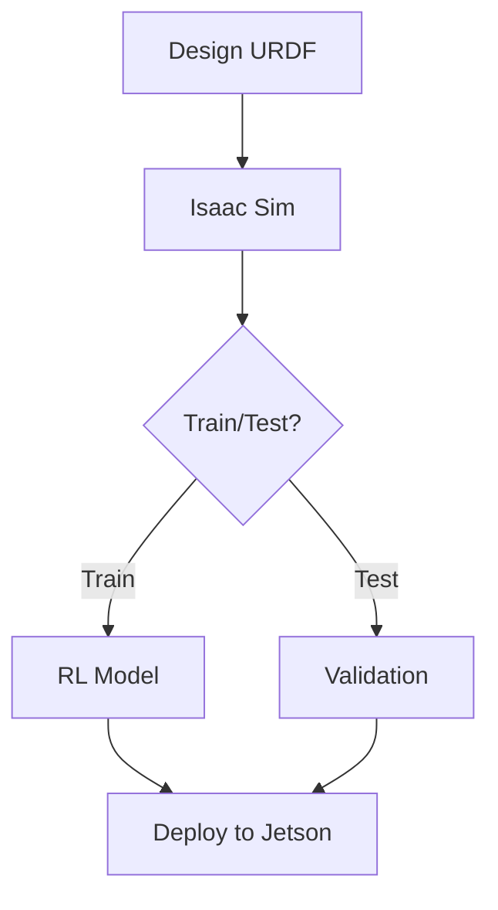
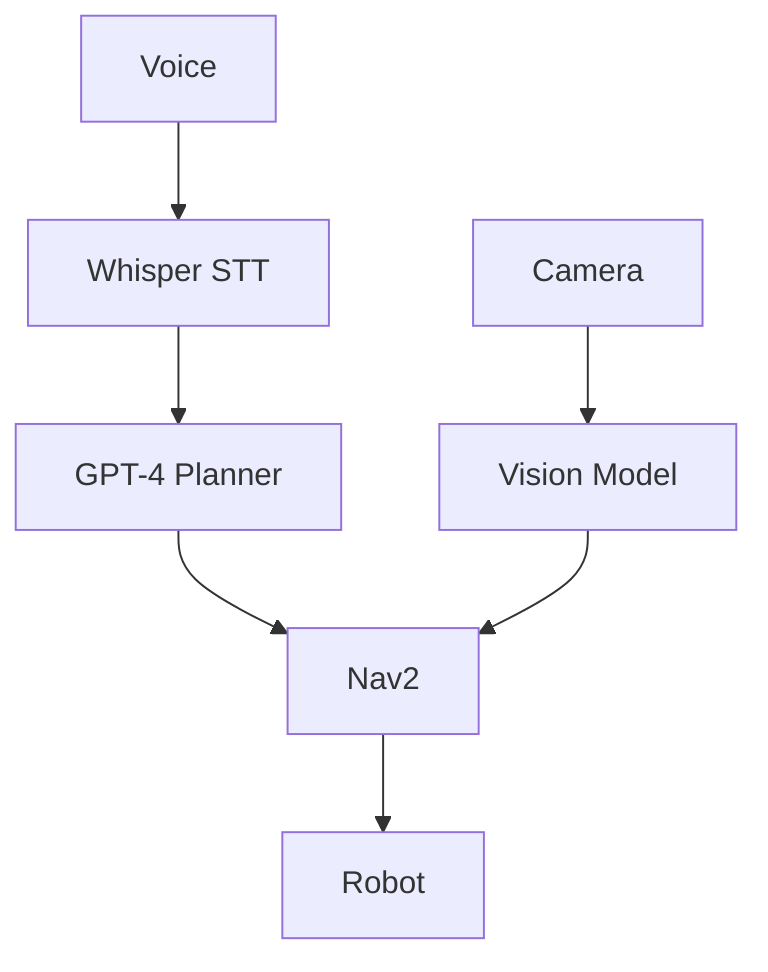

# diagramGenerator Skill

## Overview
Generates technical diagrams for Physical AI & Humanoid Robotics textbooks using Mermaid, SVG, and ASCII formats.

## Input Parameters

### Required
- **`diagramType`**: `"ros2-architecture"` | `"sensor-pipeline"` | `"control-flow"` | `"kinematic-chain"` | `"hardware-stack"` | `"perception-pipeline"` | `"workflow"` | `"system-overview"`
- **`topic`**: Specific concept to illustrate (e.g., "VSLAM Pipeline")

### Optional
- **`components`**: Array of specific components to include
- **`style`**: `"mermaid"` | `"svg"` | `"ascii"` (default: `"mermaid"`)
- **`includeLabels`**: boolean (default: `true`)
- **`annotate`**: boolean (default: `true`)

## Usage Examples

```bash
# ROS 2 Architecture
claude code --skill diagramGenerator \
  --diagramType "ros2-architecture" \
  --topic "Humanoid Joint Controller"

# Sensor Pipeline
claude code --skill diagramGenerator \
  --diagramType "sensor-pipeline" \
  --topic "VSLAM with RealSense"

# VLA Workflow
claude code --skill diagramGenerator \
  --diagramType "workflow" \
  --topic "Voice to Robot Action"
```

## Output Format

```markdown
### [Diagram Title]

```mermaid
[Diagram Code]
```

**Figure X.X**: [Caption]

#### Key Components:
- **Component**: Description

#### Learning Notes:
- Important concept
```

## Diagram Types

1. **ROS 2 Architecture** - Nodes, topics, services
2. **Sensor Pipeline** - Data flow from sensors
3. **Control Flow** - Decision logic, state machines
4. **Kinematic Chain** - Robot joint hierarchy
5. **Hardware Stack** - Component integration
6. **Perception Pipeline** - AI/ML workflows
7. **Workflow** - Development processes
8. **System Overview** - High-level architecture

## Example Templates

### ROS 2 Node Communication


### Isaac Sim Workflow


### VLA Pipeline


## Quality Guidelines

- Use correct ROS 2 terminology
- Accurate message types
- Clear, uncluttered layouts
- Educational annotations
- Color-coded components
- High contrast for accessibility

## Integration with Docusaurus

```markdown
```mermaid
graph TD
    A[Node] --> B[Topic]
\```

:::tip Learning Objective
This shows data flow in ROS 2.
:::
```

## Best Practices

1. Start simple, then enhance
2. Test rendering in Docusaurus
3. Provide text descriptions
4. Link to related code examples
5. Split complex diagrams into multiple views

## Related Skills
- `chapterWriter` - Integrates diagrams
- `codeBlockGenerator` - Pairs with code
- `labExerciseGenerator` - Uses in exercises

---
**Version**: 1.0 | **Format**: Markdown