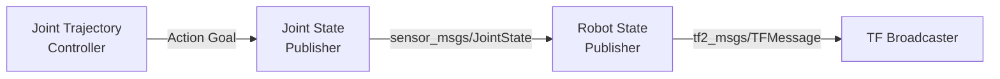
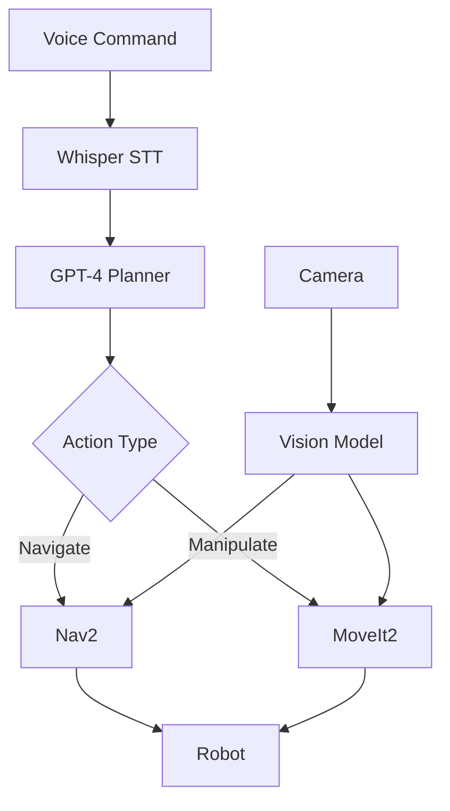
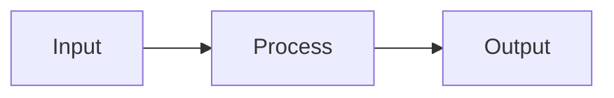
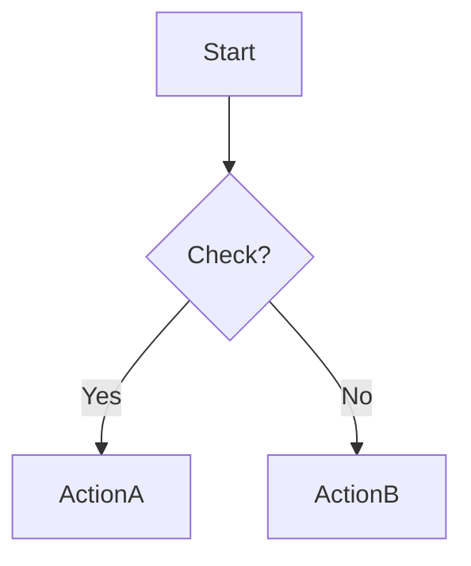

# Skill: diagram-generator

## Purpose
Creates technical diagrams and visual illustrations for Physical AI & Humanoid Robotics textbook content. Generates Mermaid diagrams for ROS 2 architectures, sensor pipelines, and system workflows.

## When to Use This Skill
* Visualizing ROS 2 node architectures and communication
* Illustrating sensor data flows and processing pipelines
* Showing robot control logic and decision flows
* Documenting hardware integration and system stacks
* Explaining simulation workflows (Isaac Sim, Gazebo)
* Creating VLA (Vision-Language-Action) pipelines

## Capabilities
- Generate 8 types of Mermaid diagrams (ROS 2, sensors, control flow, hardware, workflows)
- Add educational annotations and figure captions
- Include key components explanations
- Format for Docusaurus integration with proper markdown
- Ensure technical accuracy with correct ROS 2 terminology

## How This Skill Works
1. **Analyze**: Identify concept and select appropriate diagram type
2. **Generate**: Create Mermaid code with proper syntax and labels
3. **Annotate**: Add figure caption and key components list
4. **Format**: Wrap in Docusaurus-compatible markdown
5. **Verify**: Ensure rendering and accessibility standards

## Input Parameters

### Required
- **`diagramType`**: `"ros2-architecture"` | `"sensor-pipeline"` | `"control-flow"` | `"kinematic-chain"` | `"hardware-stack"` | `"perception-pipeline"` | `"workflow"` | `"system-overview"`
- **`topic`**: Concept to illustrate (e.g., "VSLAM Pipeline")

### Optional
- **`components`**: Array of specific components (e.g., `["camera_node", "slam_node"]`)
- **`style`**: `"mermaid"` | `"svg"` | `"ascii"` (default: `"mermaid"`)
- **`includeLabels`**: Show detailed labels (default: `true`)
- **`annotate`**: Add learning notes (default: `true`)

## Output Format

```markdown
### [Diagram Title]

```mermaid
[Mermaid Code]
```

**Figure X.X**: [Caption]

#### Key Components:
- **Component**: Description

:::tip Learning Objective
[Educational note]
:::
```

---

## Example Usage

### Example 1: ROS 2 Architecture

**Input**: 
```bash
claude code --skill diagramGenerator \
  --diagramType "ros2-architecture" \
  --topic "Humanoid Joint Controller"
```

**Output**:
````markdown
### ROS 2 Joint Control Architecture



**Figure 2.3**: ROS 2 joint control showing motion planning through trajectory execution.

#### Key Components:
- **Joint State Publisher**: Broadcasts current joint positions/velocities
- **Robot State Publisher**: Computes forward kinematics and TF transforms
- **Joint Trajectory Controller**: Executes planned trajectories with PID control

:::tip Learning Objective
Notice how ROS 2 decouples planning from low-level control for modularity.
:::
````

---

### Example 2: VLA Pipeline

**Input**:
```bash
claude code --skill diagramGenerator \
  --diagramType "workflow" \
  --topic "Voice to Robot Action"
```

**Output**:
````markdown
### Voice-Language-Action Pipeline



**Figure 4.5**: VLA pipeline integrating speech, LLM planning, and robotic control.

#### Key Components:
- **Whisper**: Speech-to-text for voice commands
- **GPT-4**: Converts language to action sequences
- **Vision Model**: Provides environmental context
- **Nav2/MoveIt2**: Navigation and manipulation execution

:::tip Learning Objective
VLA represents embodied AI—language understanding meets physical action.
:::
````

---

## Diagram Types

1. **ros2-architecture** - Nodes, topics, services
2. **sensor-pipeline** - Data flow from sensors
3. **control-flow** - Decision logic, state machines
4. **kinematic-chain** - Joint hierarchy
5. **hardware-stack** - Component integration
6. **perception-pipeline** - AI/ML workflows
7. **workflow** - Development processes
8. **system-overview** - High-level architecture

## Quality Guidelines

- Use correct ROS 2 terminology and message types
- Keep layouts clear and uncluttered
- Add educational annotations
- Ensure high contrast for accessibility
- Test rendering in Docusaurus

## Integration with Docusaurus

Requires `@docusaurus/theme-mermaid` plugin:

```js
// docusaurus.config.js
markdown: { mermaid: true },
themes: ['@docusaurus/theme-mermaid']
```

## Common Patterns

**Node Communication**:


**Pipeline**:


**Decision**:


## Usage Notes

- Requires Docusaurus with Mermaid plugin
- Split complex diagrams into multiple views
- Match chapter learning objectives
- Consistent color scheme across textbook

## Related Skills

- `chapter-outliner` - Plans diagram placement
- `tech_writer` - Writes accompanying text
- `content_architect` - Determines visualization needs

---

**Version**: 1.0.0 | **Format**: Markdown + Mermaid | **Updated**: Nov 2024