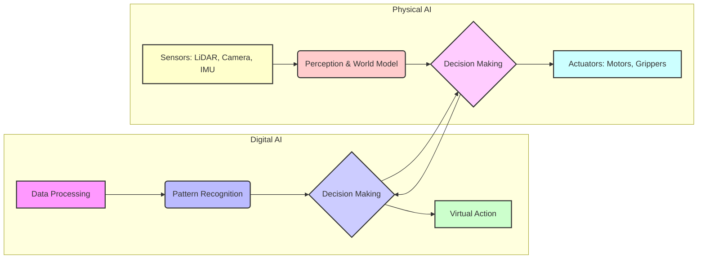
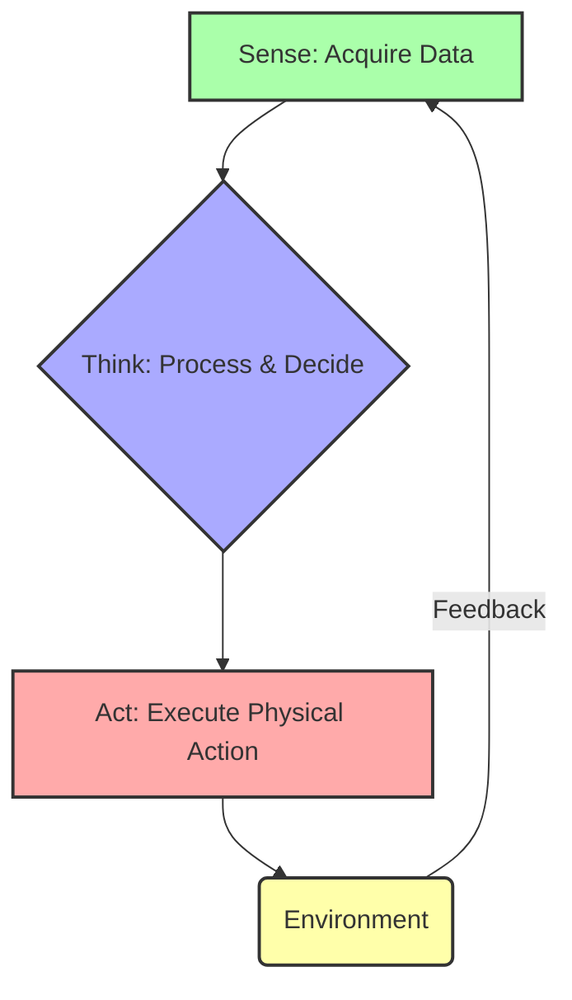
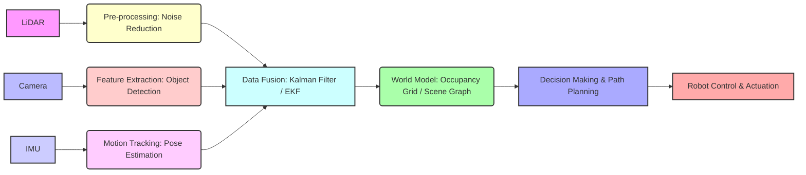

import { ChapterTranslator } from '@site/src/components/Translation';

# Chapter 1: Introduction to Physical AI and Embodied Intelligence

<ChapterTranslator chapterId="module-1/chapter-01-intro-physical-ai" />

## 1.0. Chapter Overview

This chapter introduces the fundamental concepts of Physical AI and embodied intelligence. We will explore how these advanced forms of artificial intelligence differ from traditional digital AI systems by examining their capability to interact directly with the physical world. A significant focus will be placed on understanding various sensor systems—such as LiDAR, cameras, and Inertial Measurement Units (IMUs)—which are crucial for robots to perceive their surroundings. Furthermore, we will discuss the relevance of humanoid robot forms in facilitating human-AI interaction and their utility as AI training platforms. The chapter concludes with an overview of real-world applications of Physical AI, setting the stage for more advanced topics in robotics and AI.

### Learning Outcomes:
Upon completing this chapter, you will be able to:
*   Define Physical AI and embodied intelligence.
*   Explain the transition from digital to physical AI systems.
*   Identify key sensor types (LiDAR, cameras, IMUs) and their roles in robotics.
*   Describe why the humanoid form is relevant for AI and human interaction.
*   List real-world applications of Physical AI.

## 1.1. From Digital to Physical: The Evolution of AI

Artificial Intelligence (AI) has undergone a significant evolution, moving from purely digital realms to systems that directly engage with our physical world. This transition marks a new era where AI is not just processing data but actively perceiving, moving, and interacting within dynamic environments.

### 1.1.1. Understanding Traditional Digital AI

Traditional digital AI primarily operates within virtual or abstract environments. These systems excel at tasks that involve data processing, pattern recognition, and decision-making based on vast datasets.

*   **Characteristics**: Digital AI systems often process symbolic information, rely on abstract representations, and operate without direct physical embodiment. Their intelligence is demonstrated through computational tasks.
*   **Limitations**: While powerful in their domain, digital AI often struggles with tasks requiring common sense, real-world manipulation, or understanding nuanced physical interactions. They lack the ability to directly perceive or act in dynamic, unstructured physical environments.
*   **Examples**:
    *   **Chess AI**: Programs like Deep Blue demonstrated superhuman ability in strategy games, operating entirely within a digital board representation.
    *   **Recommendation Systems**: Algorithms that suggest movies, products, or music based on user preferences and historical data.
    *   **Natural Language Processing (NLP)**: AI that understands and generates human language, used in chatbots, translation services, and sentiment analysis.

### 1.1.2. Introducing Physical AI (Urdu Translation Note: فزیکل اے آئی)

Physical AI represents a paradigm shift where AI systems are designed to exist and operate within the physical world. Unlike their digital counterparts, Physical AI agents are equipped to perceive their environment, make decisions, and execute actions that result in physical changes.

*   **Definition**: Physical AI refers to artificial intelligence systems that are integrated into physical bodies (robots) and can interact directly with the real world through sensing and actuation.
*   **Key Characteristics**:
    *   **Perception**: Ability to gather information from the physical environment using various sensors.
    *   **Action**: Capability to perform physical movements or manipulate objects using effectors (e.g., robotic arms, wheels).
    *   **Interaction**: Engaging with humans, other robots, or objects in a shared physical space.

### 1.1.3. Embodied Intelligence (Urdu Translation Note: مجسم ذہانت)

Embodied intelligence is a concept closely linked to Physical AI, emphasizing the crucial role of a physical body in the development and expression of intelligence. It suggests that an agent's physical form, sensory capabilities, and motor actions are not merely tools but integral components of its cognitive processes.

*   **Definition**: Embodied intelligence posits that an intelligent agent's cognitive abilities are deeply rooted in its physical body and its interactions with the environment. The body provides constraints, opportunities, and a unique perspective that shapes how the agent perceives, thinks, and acts.
*   **The Grounding Problem**: This problem highlights the challenge of connecting abstract symbols (used in traditional AI) to real-world meanings and experiences. Embodied intelligence offers a potential solution by providing a direct link between symbolic representations and physical sensations, perceptions, and actions. For instance, a robot that *feels* the weight of an object can ground the concept of "heavy" in its physical experience, something a purely digital AI cannot.

### Digital AI vs Physical AI Comparison

**Figure 1.1**: Comparison between Digital AI (operating in virtual environments) and Physical AI (interacting directly with the real world through sensors and actuators).

#### Key Components:
- **Digital AI**: Focuses on data processing, pattern recognition, and virtual actions within abstract domains.
- **Physical AI**: Integrates sensing, perception, decision-making, and physical actuation to interact with the real world.
- **Bidirectional Influence**: Shows that Physical AI often incorporates digital AI components for advanced reasoning, and digital AI can be informed by physical interaction.

:::tip Learning Objective
This diagram illustrates the fundamental shift from abstract data manipulation to embodied interaction with the environment, which is central to Physical AI.
:::

## 1.2. The Sense-Think-Act Cycle in Physical AI

The fundamental operational principle of Physical AI systems is the **Sense-Think-Act** cycle, often referred to as the sensorimotor loop. This iterative process allows an intelligent agent to continuously adapt to and influence its environment.

### 1.2.1. Sense: Perceiving the Environment

The first stage involves gathering information from the physical world. Robots are equipped with various sensors that mimic human senses, allowing them to collect data about their surroundings. This sensory input provides the raw information needed to understand the current state of the environment.

*   **Role of Sensory Input**: Sensors provide data such as images, distances, temperatures, forces, and sounds. This data is critical for tasks like localization (knowing where the robot is), mapping (understanding the layout of the environment), and object detection (identifying objects and their properties).

### 1.2.2. Think: Processing and Decision Making

Once sensory data is collected, the AI system processes this information to make sense of the environment and determine an appropriate course of action. This stage involves complex computational tasks, often leveraging machine learning algorithms.

*   **Internal Representations**: The raw sensor data is transformed into meaningful internal representations or "world models." These models help the AI understand spatial relationships, object identities, and environmental dynamics.
*   **Decision Making**: Based on the world model and its predefined goals, the AI makes decisions. This could involve path planning, choosing an object to grasp, or reacting to an obstacle.

### 1.2.3. Act: Interacting with the Physical World

The final stage of the cycle involves the robot executing physical actions based on the decisions made in the "Think" phase. These actions can range from simple movements to complex manipulations.

*   **Motor Control**: This involves sending commands to motors and actuators to control the robot's body parts (e.g., wheels, legs, arms, grippers).
*   **Manipulation**: For robots designed to interact with objects, this includes tasks like grasping, lifting, pushing, or assembling.

### The Sense-Think-Act Cycle in Physical AI

**Figure 1.2**: The iterative Sense-Think-Act cycle, a core principle of Physical AI, demonstrating continuous interaction with the environment.

#### Key Components:
- **Sense**: Robots gather data from the physical world using various sensors (e.g., cameras, LiDAR, IMUs).
- **Think**: The AI system processes sensory data, builds an internal world model, and makes decisions based on its goals and understanding.
- **Act**: The robot executes physical actions (e.g., movement, manipulation) that influence the environment.
- **Feedback Loop**: The environment's response to actions provides new sensory input, closing the loop and enabling continuous adaptation.

:::tip Learning Objective
Understanding this cycle is crucial for designing autonomous robots that can intelligently respond to dynamic real-world situations.
:::

<!-- EXAMPLE 1.1: Simple Embodied Action (Pseudocode) -->

## 1.3. Sensor Systems for Robotic Perception

Sensors are the "eyes" and "ears" of a robot, enabling it to perceive and understand its environment. A combination of different sensor types is often used to provide a comprehensive view of the physical world.

### 1.3.1. LiDAR (Light Detection and Ranging) (Urdu Translation Note: لائیڈار)

LiDAR is a remote sensing method that uses pulsed laser light to measure distances to the Earth's surface. These light pulses—combined with other data recorded by the airborne system—generate precise, three-dimensional information about the shape of the Earth and its surface characteristics.

*   **Principle**: LiDAR systems emit laser beams and measure the time it takes for these beams to reflect off objects and return to the sensor. This "time-of-flight" measurement allows for highly accurate distance calculations.
*   **Applications**:
    *   **Mapping**: Creating detailed 2D or 3D maps of environments, crucial for autonomous navigation.
    *   **Navigation**: Detecting obstacles, identifying free space, and assisting robots in moving safely through complex terrains.

### 1.3.2. Cameras (Computer Vision) (Urdu Translation Note: کیمرے)

Cameras provide visual information, similar to human eyes, which is then processed using computer vision techniques. Computer vision enables robots to "see" and interpret their surroundings.

*   **Types**:
    *   **Monocular Cameras**: Standard cameras that capture 2D images, used for object recognition, tracking, and basic scene analysis.
    *   **Stereo Cameras**: Mimic human binocular vision by using two cameras to capture images from slightly different perspectives, allowing for depth perception and 3D reconstruction.
    *   **Depth Cameras**: Specialized cameras (e.g., using infrared patterns) that directly measure the distance to objects, providing a "depth map" of the scene.
*   **Object Recognition**: Identifying specific objects within an image or video feed.
*   **Scene Understanding**: Interpreting the overall context of a visual scene, including the layout, the presence of specific features, and potential human activities.

### 1.3.3. IMUs (Inertial Measurement Units) (Urdu Translation Note: آئی ایم یوز)

IMUs are electronic devices that measure and report a body's specific force, angular rate, and sometimes the magnetic field surrounding the body, using a combination of accelerometers, gyroscopes, and sometimes magnetometers.

*   **Motion Sensing**: Accelerometers measure linear acceleration, indicating changes in speed and direction.
*   **Orientation**: Gyroscopes measure angular velocity, detecting rotation and helping to determine the robot's orientation in space.
*   **Balance**: By combining accelerometer and gyroscope data, IMUs can track a robot's tilt, roll, and yaw, which is critical for maintaining balance in dynamic environments or for aerial drones.

### 1.3.4. Data Fusion: Combining Sensor Inputs

No single sensor can provide all the information a robot needs. Data fusion is the process of integrating data from multiple sensors to obtain a more complete, accurate, and reliable understanding of the environment than could be achieved with individual sensors alone.

*   **Importance of Multi-modal Perception**: By combining information from, for example, a LiDAR (for accurate distances and mapping) and a camera (for object identification and color), a robot can overcome the limitations of each sensor and achieve a robust perception of its surroundings.

<!-- EXAMPLE 1.2: Basic Sensor Data Reading (Pseudocode) -->

### Humanoid Robot Sensor Data Flow

**Figure 1.3**: Illustration of how multiple sensor inputs (LiDAR, Camera, IMU) are pre-processed, fused, and used to build a coherent world model for decision-making and robot control in a humanoid robot.

#### Key Components:
- **LiDAR**: Provides accurate distance and 3D spatial data for mapping and obstacle detection.
- **Camera**: Offers visual information for object recognition, scene understanding, and depth estimation.
- **IMU**: Measures orientation and acceleration for motion tracking and balance.
- **Pre-processing**: Initial filtering and enhancement of raw sensor data.
- **Data Fusion**: Combines information from various sensors to create a more robust and complete understanding of the environment.
- **World Model**: An internal representation of the environment, used by the AI for navigation and and interaction.
- **Decision Making & Path Planning**: The cognitive layer that utilizes the world model to determine actions.
- **Robot Control & Actuation**: Executes the physical commands to the robot's motors and effectors.

:::tip Learning Objective
Effective robotic perception relies on integrating diverse sensor data through fusion techniques to overcome individual sensor limitations.
:::

## 1.4. The Humanoid Form: A Foundation for Embodied AI

While robots come in many shapes and sizes (e.g., wheeled robots, drones, industrial arms), the humanoid form holds particular significance for Physical AI and embodied intelligence, especially in human-centric environments.

### 1.4.1. Advantages of Humanoid Morphology

Humanoid robots, designed to resemble the human body, offer several unique advantages:

*   **Operating in Human-Centric Environments**: Our world is designed for humans. Humanoid robots can navigate spaces, open doors, use tools, and interact with objects designed for human hands, making them versatile in domestic, commercial, and industrial settings.
*   **Tool Use**: With human-like hands and manipulators, humanoids can utilize a wide range of existing human tools, from wrenches to keyboards, without requiring specialized robotic versions.
*   **Social Interaction**: The human form facilitates more natural and intuitive social interaction with humans, which is crucial for applications in healthcare, education, and customer service. People are often more comfortable interacting with robots that have familiar physical characteristics.

### 1.4.2. Challenges in Humanoid Robotics

Despite their advantages, designing and controlling humanoid robots presents significant engineering and AI challenges:

*   **Balance**: Maintaining balance on two legs, especially during movement, manipulation, or in uneven terrain, is a complex control problem.
*   **Dexterity**: Achieving human-level dexterity in hands and fingers for fine manipulation tasks remains an active area of research.
*   **Complex Control**: Coordinating the numerous joints and degrees of freedom in a humanoid body requires sophisticated control algorithms to ensure smooth, stable, and purposeful movements.

### 1.4.3. Humanoids as AI Training Platforms

Humanoid robots serve as excellent platforms for developing and testing advanced AI algorithms. Their ability to interact with the physical world in a human-like manner makes them ideal for:

*   **Learning from Human Demonstrations**: AI systems can learn complex skills by observing and mimicking human actions on humanoid robots, enabling a more intuitive transfer of knowledge.
*   **Transfer Learning**: Skills learned in simulation or on one humanoid platform can often be transferred to another, accelerating the development of new robotic capabilities.

## 1.5. Applications of Physical AI in the Real World

Physical AI is no longer a concept confined to science fiction; it is rapidly transforming various industries and aspects of daily life.

### 1.5.1. Service Robotics

Robots designed to assist humans in various service-oriented tasks are a prime example of Physical AI in action.
*   **Healthcare**: Surgical robots, assistive robots for the elderly, and hospital delivery robots.
*   **Logistics**: Autonomous mobile robots (AMRs) in warehouses for picking and sorting, delivery robots for last-mile delivery.

### 1.5.2. Autonomous Vehicles

Self-driving cars, trucks, and drones are highly sophisticated Physical AI systems that perceive their environment, make complex decisions, and navigate without human intervention.
*   **Perception**: Utilizing LiDAR, cameras, radar, and ultrasonic sensors to understand traffic, pedestrians, and road conditions.
*   **Decision Making**: AI algorithms for path planning, obstacle avoidance, and adhering to traffic laws.

### 1.5.3. Industrial Automation and Collaborative Robots

Robots have long been a staple in manufacturing, but Physical AI is leading to more flexible and collaborative systems.
*   **Industrial Automation**: Robots performing repetitive tasks on assembly lines, such as welding, painting, and precise component placement.
*   **Collaborative Robots (Cobots)**: Robots designed to work safely alongside human workers, assisting with tasks that require strength or precision.

### 1.5.4. Exploration and Disaster Response

Physical AI-powered robots are deployed in environments too dangerous or inaccessible for humans.
*   **Space Exploration**: Rovers on Mars collecting samples and data.
*   **Underwater Exploration**: Autonomous underwater vehicles (AUVs) mapping seabeds and inspecting infrastructure.
*   **Disaster Response**: Robots entering collapsed buildings, detecting hazards, and searching for survivors in earthquake or radiation affected areas.

## 1.6. Chapter Summary

In this introductory chapter, we have laid the groundwork for understanding Physical AI and embodied intelligence. We distinguished Physical AI from traditional digital AI by highlighting its direct interaction with the physical world through perception and action. We explored the core Sense-Think-Act cycle that governs robot behavior and delved into the essential sensor systems—LiDAR, cameras, and IMUs—that enable robots to perceive their environment effectively. The unique role of humanoid robots as a platform for advanced AI development and human interaction was also discussed. Finally, we surveyed a range of real-world applications demonstrating the transformative impact of Physical AI across various sectors. This foundation will be crucial as we delve deeper into the specific technologies and methodologies, such as ROS 2, that enable the development of sophisticated Physical AI systems.

## 1.7. References

*(APA citation style)*
