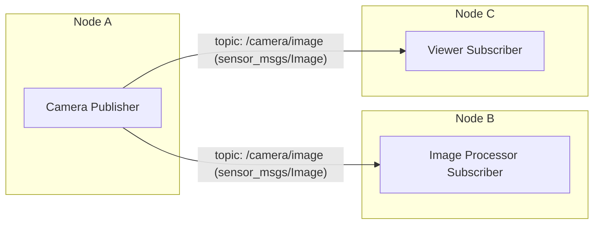
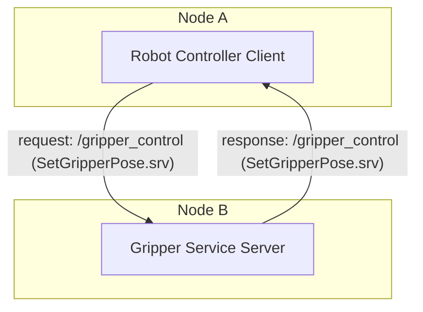

# Chapter 2: ROS 2 Architecture Fundamentals

## Introduction to the Robotic Nervous System

In the realm of robotics, just as the human body relies on a sophisticated nervous system to coordinate movement, process sensory input, and execute commands, a complex robot needs an equally robust and flexible architecture to manage its myriad components. This is where the Robot Operating System 2 (ROS 2) comes into play, serving as the "nervous system" for modern robotic platforms.

ROS 2 is not an operating system in the traditional sense, but rather a flexible framework for writing robot software. It provides a collection of tools, libraries, and conventions that simplify the task of creating complex and robust robot applications. Building upon the foundational success of its predecessor, ROS 1, ROS 2 was re-architected from the ground up to address critical requirements for industrial applications, multi-robot systems, and real-time performance, making it highly suitable for Physical AI and humanoid robotics.

This chapter will delve into the core architectural concepts of ROS 2. We will explore its modular structure, focusing on how individual software components (nodes) encapsulate functionality and communicate seamlessly. We will examine the various communication paradigms—asynchronous topics, synchronous services, and long-running actions—that enable intricate interactions within a robotic system. Furthermore, we will demystify the Data Distribution Service (DDS), the sophisticated middleware underlying ROS 2's communication, and understand the critical role of Quality of Service (QoS) profiles in ensuring reliable and robust data exchange. Finally, we will draw a high-level comparison between ROS 2 and ROS 1 to highlight the significant advancements and design philosophies that define the current generation of robot software.

## The Modular Core: ROS 2 Nodes

The fundamental building block of any ROS 2 application is the **node**. Analogous to a biological neuron, a node is an executable process that performs a specific, single-purpose computation within the robotic system. By breaking down complex robot functionalities into smaller, independent nodes, ROS 2 promotes a highly modular and distributed architecture. This modularity offers several significant advantages:

*   **Reusability**: Individual nodes can be developed, tested, and deployed independently, and then reused across different robotic projects or even different robots, provided their interfaces remain consistent. For instance, a camera driver node can be used with various image processing nodes.
*   **Decoupling**: Nodes operate independently, without direct knowledge of other nodes' internal implementations. They interact solely through well-defined communication interfaces. This reduces interdependencies, making the system easier to maintain and debug.
*   **Fault Tolerance**: If one node crashes, it ideally should not bring down the entire robotic system. Due to their decoupled nature, other nodes can often continue operating, or gracefully handle the failure of a single component.
*   **Scalability**: New functionalities can be added by simply integrating new nodes into the existing ROS 2 graph, without requiring extensive modifications to existing code. This allows for incremental development and easy expansion of capabilities.
*   **Distribution**: Nodes can run on different processes, different machines, or even different operating systems, facilitating distributed computation across various hardware platforms in a multi-robot setup.

### Conceptual ROS 2 Node

```mermaid
graph LR
    subgraph Node A (Publisher)
        P1[Data Source] --> T1(Topic: /data/raw)
    end
    subgraph Node B (Subscriber)
        T1 --> S1[Data Consumer]
    end
    subgraph Node C (Service Server)
        SrvS1[Compute Service]
    end
    subgraph Node D (Service Client)
        SrvC1[Requestor] --> SrvS1
    end
    subgraph Node E (Action Server)
        ActS1[Long-running Task]
    end
    subgraph Node F (Action Client)
        ActC1[Goal Sender] --> ActS1
    end

    T1 -- Data Flow --> S1
    SrvC1 -- Request/Response --> SrvS1
    ActC1 -- Goal/Feedback/Result --> ActS1
```

**Figure 2.1**: A simplified overview of ROS 2 communication patterns, including topics (publisher/subscriber), services (client/server), and actions (goal/feedback/result).

#### Key Components:
- **Topics**: Asynchronous, one-way data streaming (e.g., sensor data).
- **Services**: Synchronous, request-response communication for immediate operations.
- **Actions**: Asynchronous, goal-oriented tasks with feedback and results for long-running operations.

---


## Inter-Node Communication Mechanisms

Effective collaboration between nodes is paramount for a robotic system to function cohesively. ROS 2 provides several distinct communication mechanisms, each tailored for different interaction patterns: Topics for asynchronous data streaming, Services for synchronous request-response interactions, and Actions for long-running, goal-oriented tasks.

### Topics: Asynchronous Publisher-Subscriber Pattern

**Topics** are the most common communication mechanism in ROS 2, enabling asynchronous, one-to-many or many-to-many data streaming. This pattern is ideal for continuous data flows where nodes produce data without needing an immediate response, and other nodes consume that data as it becomes available.

#### How it Works:
1.  **Publishers**: A node that generates data and sends it to a named **topic**. The publisher does not know or care if any other node is subscribed to its topic. It simply broadcasts messages.
2.  **Subscribers**: A node that expresses interest in a specific topic and receives messages published to it. A subscriber receives all messages sent to its subscribed topic.
3.  **Messages**: The data units exchanged over topics. Each message has a predefined **message type** that dictates its structure (e.g., `sensor_msgs/Image`, `geometry_msgs/Twist`, `std_msgs/String`). This strict typing ensures data consistency and allows for serialization/deserialization across different programming languages.

### DDS QoS Profiles Explained

```mermaid
graph TD
    A[DDS Communication] --> B{Choose QoS Profile}

    subgraph QoS Policies
        B --> C[Reliability: BEST_EFFORT / RELIABLE]
        B --> D[Durability: VOLATILE / TRANSIENT_LOCAL]
        B --> E[History: KEEP_LAST / KEEP_ALL]
        B --> F[Liveliness: AUTOMATIC / MANUAL_BY_TOPIC]
        B --> G[Deadline: (ms)]
        B --> H[Lifespan: (ms)]
    end

    C -- High-Freq Sensor Data --> R1(BEST_EFFORT)
    C -- Critical Commands --> R2(RELIABLE)

    D -- New Subscribers Need Old Data --> D1(TRANSIENT_LOCAL)
    D -- Only Live Data Needed --> D2(VOLATILE)

    E -- Latest Value Only --> E1(KEEP_LAST=1)
    E -- All Data Retained --> E2(KEEP_ALL)

    R1 & D2 & E1 -- Typical for Sensor Streams --> App1[Autonomous Driving / Drone Control]
    R2 & D1 & E2 -- Typical for Control & Configuration --> App2[Robot Arm Manipulation / System Initialization]
```

**Figure 2.2**: An overview of key DDS Quality of Service (QoS) policies in ROS 2, illustrating how different settings impact communication reliability and behavior.

#### Key Components:
- **Reliability**: Guarantees message delivery (RELIABLE) or prioritizes speed (BEST_EFFORT).
- **Durability**: Determines if old messages are delivered to new subscribers (TRANSIENT_LOCAL).
- **History**: How many messages are kept in the buffer.
- **Liveliness**: Detects if participants are still active.
- **Deadline/Lifespan**: Time constraints on message production and validity.



**Figure 2.2**: A conceptual illustration of the ROS 2 topic communication pattern, demonstrating a single publisher broadcasting messages to multiple subscribers over a named topic.


### Services: Synchronous Client-Server Pattern

While topics are excellent for continuous data streams, sometimes a node needs to request a specific computation or action from another node and wait for a definite response. This is where **services** come in, implementing a synchronous client-server communication pattern.

#### How it Works:
1.  **Service Server**: A node that offers a specific service. It registers itself on the ROS 2 graph with a service name and waits for requests. When a request arrives, it performs the required computation and sends back a response.
2.  **Service Client**: A node that makes a request to a service server. The client sends a request message and blocks (or awaits asynchronously) until it receives a response message from the server.
3.  **Service Type**: Defines both the structure of the **request** message and the **response** message for a particular service (e.g., `MoveGripper.srv` might have a `target_position` in the request and a `success` boolean in the response).

### Conceptual ROS 2 Service



**Figure 2.3**: A conceptual representation of a ROS 2 service, demonstrating a client making a synchronous request to a service server and awaiting a response.

#### Key Components:
- **Service Client Node**: A ROS 2 node that initiates a service call. The "Robot Controller Client" node requests the gripper to move to a specific pose.
- **Service Server Node**: A ROS 2 node that provides a service, implementing the logic to fulfill requests. The "Gripper Service Server" node executes the gripper movement.
- **Service**: A named interface (e.g., `/gripper_control`) that enables synchronous request-response communication between nodes.
- **Service Type**: Defines the structure of both the request and response messages for a particular service (e.g., `SetGripperPose.srv`).

:::tip Learning Objective
Services are used for synchronous, one-to-one communication where the client expects an immediate response from the server. This is ideal for command-and-control operations that require a confirmation or result.
:::

Refer to the "Conceptual ROS 2 Service" diagram (Figure 2.3). A `Robot Controller Client` node might send a request to a `Gripper Service Server` node via the `/gripper_control` service to open or close the robot's gripper to a specific position. The `Gripper Service Server` then executes the command and sends back a response indicating whether the operation was successful. The client waits for this response before proceeding with further actions, ensuring the gripper operation is complete.

#### Use Cases:
*   Triggering one-off actions (e.g., "take a picture," "calibrate sensor," "reset robot pose").
*   Querying information (e.g., "get current battery level," "lookup object pose").
*   Performing complex calculations that return a single result (e.g., inverse kinematics for a target pose).

### Actions: Long-Running Goal-Feedback-Result Pattern

For tasks that are long-running, interruptible, and require continuous feedback, ROS 2 provides **actions**. Actions combine aspects of topics and services, offering a more complex but powerful communication pattern for goal-oriented behaviors. They are particularly useful for robot movements or complex task execution that cannot be completed instantly.

#### How it Works:
1.  **Action Server**: A node that offers a specific action. It accepts goals from clients, processes them, provides periodic feedback on progress, and eventually sends a final result. It can also be preempted (cancelled) by a client.
2.  **Action Client**: A node that sends a goal to an action server. It can monitor the goal's status, receive streaming feedback, and eventually retrieve the final result. It can also send a request to cancel the goal.
3.  **Action Type**: Defines the structure of the **goal** message, the **feedback** message, and the **result** message for a particular action.

Consider a humanoid robot's navigation stack. An `Action Client` (e.g., a high-level task planner) might send a `NavigateToPose` goal to an `Action Server` (e.g., the robot's navigation node). As the robot moves, the `Action Server` can send back `feedback` messages (e.g., "current robot position," "distance to goal," "estimated time remaining"). Once the robot reaches the destination, the `Action Server` sends a `result` message (e.g., "navigation successful," "robot stuck"). The client can use the feedback to update its display or adjust its strategy, and the final result determines the next step in the overall task.

#### Use Cases:
*   Navigation (e.g., "go to a specific room").
*   Manipulation (e.g., "pick up an object").
*   Complex sensor processing that takes time (e.g., "perform a 3D scan of the environment").
*   Any task that involves executing a goal over an extended period, where progress monitoring and potential cancellation are necessary.

## The Communication Backbone: Data Distribution Service (DDS)

A cornerstone of ROS 2's architectural robustness and performance is its reliance on the **Data Distribution Service (DDS)** as its underlying communication middleware. Unlike ROS 1, which used a custom TCP/IP-based communication layer managed by a central `roscore`, ROS 2 leverages DDS—an open international standard for real-time, high-performance, and scalable data exchange in distributed systems.

#### Key Aspects of DDS:
*   **Decentralized Architecture**: DDS operates without a central broker or master node. Nodes discover each other and establish direct communication paths, leading to greater fault tolerance and eliminating single points of failure. If one node or machine goes down, the rest of the system can continue to operate.
*   **Vendor Independence**: DDS is a standard (defined by the Object Management Group, OMG), meaning there are multiple compliant implementations (e.g., Fast DDS, Cyclone DDS, RTI Connext). This allows users to choose the DDS vendor that best suits their specific needs in terms of performance, features, and licensing.
*   **Quality of Service (QoS) Policies**: DDS natively provides a rich set of QoS policies that allow developers to fine-tune communication behavior (discussed in the next section). This is critical for meeting real-time and reliability requirements in robotics.
*   **Platform Agnostic**: DDS supports various operating systems and programming languages, which enhances the portability and interoperability of ROS 2 applications.
*   **Scalability**: Designed for large-scale distributed systems, DDS can efficiently manage data flow among hundreds or thousands of nodes, making it suitable for complex multi-robot deployments.

The integration of DDS significantly elevates ROS 2's capabilities, particularly in domains like Physical AI and humanoid robotics, where low-latency communication, robustness, and determinism are often critical for safe and effective operation.

## Quality of Service (QoS) Profiles

The robust foundation provided by DDS enables ROS 2 to offer highly configurable **Quality of Service (QoS) profiles**. QoS settings allow developers to specify the desired behavior for message delivery, reliability, and data persistence for each topic, service, or action. By configuring QoS, developers can optimize communication to meet the specific requirements of different types of data and applications, from high-throughput sensor streams to critical control commands.

#### Key QoS Policies:
*   **Reliability**:
    *   `BEST_EFFORT`: Messages are sent without guarantee of arrival. If the network is congested, messages might be dropped. This is suitable for high-frequency sensor data where missing a few readings is acceptable (e.g., camera streams, LiDAR scans).
    *   `RELIABLE`: Messages are guaranteed to arrive at their destination, even if retransmissions are required. This is essential for critical command and control messages, such as motor commands or emergency stops.
*   **Durability**:
    *   `VOLATILE`: Only subscribers that are active when a message is published will receive it. Old messages are not retained.
    *   `TRANSIENT_LOCAL`: The publisher will store a limited history of messages and deliver them to new subscribers when they join the network. Useful for parameters or configurations that new nodes need upon startup.
*   **History**:
    *   `KEEP_LAST`: Only the N most recent messages are kept in the buffer. If N is 1, only the latest message is stored.
    *   `KEEP_ALL`: All messages are kept in the buffer until the system's resource limits are reached.
*   **Liveliness**:
    *   Ensures that participants in a topic are actively communicating. If a node fails to send data or assert its liveliness, other nodes can detect its absence. Important for detecting node failures.
*   **Deadline**:
    *   Specifies the expected maximum time between data publications. Subscribers can detect if a publisher is failing to meet its expected publication rate.
*   **Lifespan**:
    *   Defines how long a message is valid. Messages older than their lifespan are discarded.

Choosing the correct QoS profile is a critical design decision in ROS 2. For instance, a robot's emergency stop command should use `RELIABLE` durability and `TRANSIENT_LOCAL` history to ensure that the command is delivered even if a receiver temporarily disconnects and reconnects. Conversely, a high-rate LiDAR sensor publishing hundreds of thousands of points per second might use `BEST_EFFORT` reliability to prioritize throughput over guaranteeing every single point is received, as latency is more critical.

## ROS 2 vs. ROS 1: A High-Level Comparison

The transition from ROS 1 to ROS 2 was driven by a need to address fundamental limitations in ROS 1, particularly concerning real-time capabilities, security, and multi-robot support. While both frameworks aim to provide tools for robot software development, their underlying architectures and design philosophies diverge significantly.

| Feature                 | ROS 1                                   | ROS 2                                       | Key Improvement / Rationale                                                                     |
| :---------------------- | :-------------------------------------- | :------------------------------------------ | :---------------------------------------------------------------------------------------------- |
| **Communication Layer** | Custom TCP/IP (TCPROS, UDPROS)          | Data Distribution Service (DDS)             | DDS provides standard, decentralized, and high-performance communication with QoS.              |
| **Central Master**      | `roscore` (centralized)                 | None (decentralized)                        | Eliminates single point of failure; improves fault tolerance and scalability.                   |
| **Real-time Support**   | Limited                                 | Native real-time capabilities               | Essential for industrial robotics, safety-critical systems, and precise control.                |
| **Security**            | Minimal to none                         | Built-in (DDS-Security)                     | Critical for public, industrial, and sensitive robot applications (authentication, encryption). |
| **Multi-robot Systems** | Challenging                             | First-class support                         | Easier deployment and management of fleets of robots in shared environments.                   |
| **Operating Systems**   | Primarily Linux                         | Linux, Windows, macOS, RTOS                 | Broader platform support for diverse hardware and deployment scenarios.                         |
| **Lifecycle Management**| Not explicitly defined                  | Standardized node lifecycle                 | Improves system robustness by allowing nodes to transition through well-defined states.         |
| **Actions**             | `actionlib` (separate library)          | Integrated into core                        | Seamless support for long-running, goal-oriented tasks with feedback and preemption.            |
| **Parameter Server**    | Centralized                             | Distributed (parameters are per-node)       | Decentralized and more robust parameter management.                                           |

The most prominent difference lies in the communication backbone: ROS 1's reliance on `roscore` as a central point of coordination made it susceptible to single-point failures and introduced latency in large-scale deployments. ROS 2's adoption of DDS resolves this by enabling a decentralized, peer-to-peer communication model that is inherently more robust and scalable.

Furthermore, critical needs such as security (through DDS-Security) and real-time execution capabilities were not core design goals of ROS 1 but are fundamental to ROS 2. These advancements make ROS 2 a more viable choice for modern robotic applications, particularly in industrial settings, autonomous vehicles, and the development of sophisticated humanoid robots where reliability, safety, and performance are paramount.

## Conclusion

This chapter has provided a foundational understanding of the ROS 2 architecture, the very "nervous system" that enables complex robotic systems to function. We've explored the concept of **nodes** as modular computational units, encapsulating specific functionalities and promoting a decentralized, robust design. We then delved into the diverse communication mechanisms that orchestrate interactions between these nodes:

*   **Topics** for asynchronous, many-to-many data streams, perfect for continuous sensor data.
*   **Services** for synchronous, one-to-one request-response interactions, ideal for immediate commands.
*   **Actions** for long-running, goal-oriented tasks that require feedback and the ability to be preempted.

We also uncovered the power of the **Data Distribution Service (DDS)**, the decentralized middleware that underpins ROS 2's high-performance, real-time, and scalable communication. Complementing DDS, we examined the importance of **Quality of Service (QoS) profiles**, which allow fine-grained control over communication reliability, durability, and other critical parameters to meet varied application needs. Finally, a high-level comparison with ROS 1 highlighted the significant architectural shifts and advancements that position ROS 2 as the preferred framework for contemporary and future robotic developments, especially in the demanding field of Physical AI and humanoid robotics.

With this understanding of ROS 2's core architecture, you are now equipped to appreciate how its design principles contribute to building sophisticated, reliable, and scalable robotic applications. In the next chapter, we will move from theory to practice, diving into how to build your first ROS 2 nodes using Python and `rclpy`.