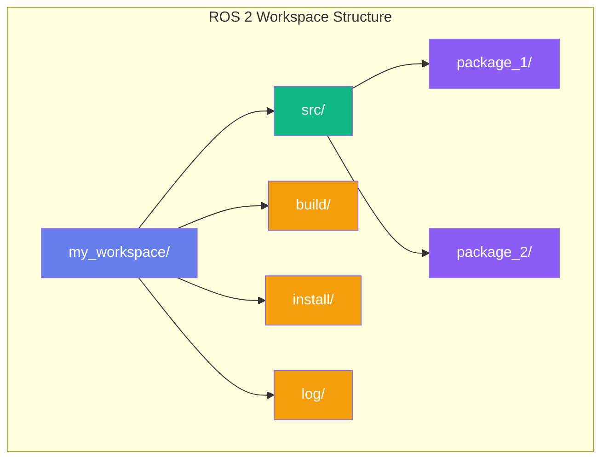

import { ChapterTranslator } from '@site/src/components/Translation';

# Chapter 3: Building Your First ROS 2 Nodes

<ChapterTranslator chapterId="module-1/chapter-03-first-nodes" />

## Introduction

Congratulations! You've learned the theoretical foundations of ROS 2 in the previous chapters. Now it's time to put that knowledge into practice and build your first ROS 2 nodes using Python. This chapter will guide you through creating publisher and subscriber nodes from scratch, helping you understand the practical implementation of the ROS 2 communication patterns you learned about.

In this chapter, you'll build a complete publisher-subscriber system that demonstrates the fundamental communication pattern in ROS 2. By the end of this chapter, you'll have a solid understanding of how to create ROS 2 packages, implement nodes that communicate through topics, and run your own ROS 2 applications.

### What You'll Build

You'll create a simple but complete ROS 2 system consisting of:
- A publisher node that sends messages containing sensor data
- A subscriber node that receives and processes these messages
- Proper package structure following ROS 2 conventions
- Working examples that demonstrate real node-to-node communication

### Why This Matters

Understanding how to create ROS 2 nodes is fundamental to robot development. Every robot system relies on nodes communicating with each other through topics, services, and actions. Mastering the publisher-subscriber pattern gives you the foundation needed to build complex robot applications, from simple sensor data processing to sophisticated control systems.

### Chapter Roadmap

This chapter is structured to take you from basic workspace setup to complete node implementation:

1. **Workspace and Package Setup**: Learn to create proper ROS 2 package structures
2. **Your First Publisher Node**: Build a node that publishes messages on a timer
3. **Your First Subscriber Node**: Create a node that receives and processes messages
4. **Debugging and Troubleshooting**: Master techniques to identify and fix common issues
5. **Chapter Summary**: Review key concepts and prepare for the next chapter

## ROS 2 Workspace and Package Setup

Before creating your first ROS 2 nodes, you need to understand the workspace structure and how to create properly structured packages. A ROS 2 workspace is simply a directory that contains ROS 2 packages, and each package follows a specific structure that allows ROS 2 tools to build and run your code.

### Creating a ROS 2 Workspace Directory Structure

ROS 2 workspaces follow a standard structure that makes it easy to manage multiple packages. The typical workspace structure looks like this:

```
my_workspace/
├── src/
│   ├── package_1/
│   ├── package_2/
│   └── ...
├── build/
├── install/
└── log/
```

The `src/` directory contains your source code packages, while `build/`, `install/`, and `log/` are created automatically when you build your workspace.



:::tip Directory Purposes
- **src/**: Your source code (you edit this)
- **build/**: Compilation artifacts (auto-generated)
- **install/**: Installed packages (auto-generated)
- **log/**: Build logs (auto-generated)
:::

Let's create a new workspace for our learning projects:

```bash
# Create a new directory for our workspace
mkdir -p ~/ros2_workspace/src
cd ~/ros2_workspace
```

### Using ros2 pkg create Command

ROS 2 provides a convenient command-line tool to create new packages with the proper structure. For Python packages, we'll use the `ament_python` build type, which is designed specifically for Python-based ROS 2 packages.

```bash
cd ~/ros2_workspace/src
ros2 pkg create --build-type ament_python my_first_ros2_pkg
```

This command creates a new package named `my_first_ros2_pkg` with the following structure:

```
my_first_ros2_pkg/
├── my_first_ros2_pkg/
│   ├── __init__.py
│   └── publisher_member_function.py
├── package.xml
├── setup.cfg
├── setup.py
└── test/
    ├── __init__.py
    └── test_copyright.py
    └── test_flake8.py
    └── test_pep257.py
```

### Understanding package.xml

The `package.xml` file contains metadata about your package, including its name, version, maintainers, dependencies, and other important information. Here's what a typical `package.xml` looks like for a Python package:

```xml
<?xml version="1.0"?>
<?xml-model href="http://download.ros.org/schema/package_format3.xsd" schematypens="http://www.w3.org/2001/XMLSchema"?>
<package format="3">
  <name>my_first_ros2_pkg</name>
  <version>0.0.0</version>
  <description>TODO: Package description</description>
  <maintainer email="user@todo.todo">user</maintainer>
  <license>TODO: License declaration</license>

  <test_depend>ament_copyright</test_depend>
  <test_depend>ament_flake8</test_depend>
  <test_depend>ament_pep257</test_depend>
  <test_depend>python3-pytest</test_depend>

  <export>
    <build_type>ament_python</build_type>
  </export>
</package>
```

This file is crucial because it tells the ROS 2 build system what dependencies your package needs and how to build it. For Python packages, the key line is `<build_type>ament_python</build_type>`, which specifies that this package should be built using the Python build system.

### Understanding setup.py

The `setup.py` file is the Python equivalent of a build configuration file. It defines how your Python package should be installed and what executables should be created. Here's the default `setup.py` created by the `ros2 pkg create` command:

```python
from setuptools import setup

package_name = 'my_first_ros2_pkg'

setup(
    name=package_name,
    version='0.0.0',
    packages=[package_name],
    data_files=[
        ('share/ament_index/resource_index/packages',
            ['resource/' + package_name]),
        ('share/' + package_name, ['package.xml']),
    ],
    install_requires=['setuptools'],
    zip_safe=True,
    maintainer='user',
    maintainer_email='user@todo.todo',
    description='TODO: Package description',
    license='TODO: License declaration',
    tests_require=['pytest'],
    entry_points={
        'console_scripts': [
        ],
    },
)
```

The most important part of this file for our purposes is the `entry_points` section, which defines the executable scripts that will be created when the package is installed. This is where you'll add your node scripts so they can be run with the `ros2 run` command.

### Package Directory Structure Breakdown

Let's examine each part of the package structure:

1. **Top-level directory (`my_first_ros2_pkg/`)**: Contains all package files
2. **Python package directory (`my_first_ros2_pkg/`)**: Contains the actual Python code
3. **`__init__.py`**: Makes the directory a Python package
4. **`package.xml`**: Package metadata and dependencies
5. **`setup.py`**: Python build configuration
6. **`setup.cfg`**: Additional Python packaging configuration
7. **`test/`**: Unit tests for your package

### Setting Up Python Entry Points for Executables

To make your ROS 2 nodes executable, you need to add them to the `entry_points` section in `setup.py`. This tells ROS 2 which Python scripts should be treated as executable commands.

For example, if you want to create a publisher node called `talker`, you would add it to the console scripts section:

```python
entry_points={
    'console_scripts': [
        'talker = my_first_ros2_pkg.publisher_member_function:main',
    ],
},
```

This creates an executable command called `talker` that runs the `main` function from the `publisher_member_function` module in the `my_first_ros2_pkg` package.

### Complete Package Setup Example

Here's a complete example of setting up a basic ROS 2 Python package:

1. First, create the workspace and package:
```bash
mkdir -p ~/ros2_workspace/src
cd ~/ros2_workspace/src
ros2 pkg create --build-type ament_python my_first_ros2_pkg
```

2. Edit the `package.xml` to add proper metadata:
```xml
<?xml version="1.0"?>
<?xml-model href="http://download.ros.org/schema/package_format3.xsd" schematypens="http://www.w3.org/2001/XMLSchema"?>
<package format="3">
  <name>my_first_ros2_pkg</name>
  <version>0.1.0</version>
  <description>My first ROS 2 package with publisher and subscriber nodes</description>
  <maintainer email="student@university.edu">Student Name</maintainer>
  <license>Apache License 2.0</license>

  <depend>rclpy</depend>
  <depend>std_msgs</depend>

  <test_depend>ament_copyright</test_depend>
  <test_depend>ament_flake8</test_depend>
  <test_depend>ament_pep257</test_depend>
  <test_depend>python3-pytest</test_depend>

  <export>
    <build_type>ament_python</build_type>
  </export>
</package>
```

Notice that we've added `<depend>rclpy</depend>` and `<depend>std_msgs</depend>` to specify that our package depends on the ROS 2 Python client library and standard message types.

3. Update the `setup.py` file to include your nodes:
```python
from setuptools import setup

package_name = 'my_first_ros2_pkg'

setup(
    name=package_name,
    version='0.1.0',
    packages=[package_name],
    data_files=[
        ('share/ament_index/resource_index/packages',
            ['resource/' + package_name]),
        ('share/' + package_name, ['package.xml']),
    ],
    install_requires=['setuptools'],
    zip_safe=True,
    maintainer='Student Name',
    maintainer_email='student@university.edu',
    description='My first ROS 2 package with publisher and subscriber nodes',
    license='Apache License 2.0',
    tests_require=['pytest'],
    entry_points={
        'console_scripts': [
            'talker = my_first_ros2_pkg.publisher_member_function:main',
            'listener = my_first_ros2_pkg.subscriber_member_function:main',
        ],
    },
)
```

With this setup, you'll be able to run your nodes using:
```bash
ros2 run my_first_ros2_pkg talker
ros2 run my_first_ros2_pkg listener
```

## Your First Publisher Node

Now let's create your first publisher node. A publisher node creates and sends messages to a topic that other nodes can subscribe to. We'll start with a simple example that publishes string messages on a timer.

### Understanding the Node Class and Initialization

Every ROS 2 node in Python inherits from the `Node` class provided by the `rclpy` library. The `Node` class handles the ROS 2 communication infrastructure, allowing you to focus on your application logic.

Here's the basic structure of a ROS 2 publisher node:

```python
import rclpy
from rclpy.node import Node
from std_msgs.msg import String


class MinimalPublisher(Node):

    def __init__(self):
        super().__init__('minimal_publisher')
        self.publisher_ = self.create_publisher(String, 'topic', 10)
        timer_period = 0.5  # seconds
        self.timer = self.create_timer(timer_period, self.timer_callback)
        self.i = 0

    def timer_callback(self):
        msg = String()
        msg.data = 'Hello World: %d' % self.i
        self.publisher_.publish(msg)
        self.get_logger().info('Publishing: "%s"' % msg.data)
        self.i += 1


def main(args=None):
    rclpy.init(args=args)

    minimal_publisher = MinimalPublisher()

    rclpy.spin(minimal_publisher)

    minimal_publisher.destroy_node()
    rclpy.shutdown()


if __name__ == '__main__':
    main()
```

### Creating Publishers with create_publisher()

The `create_publisher()` method is how you create a publisher within your node. It takes three main parameters:

1. **Message type**: The type of message to publish (e.g., `String`, `Int32`, `Float64`)
2. **Topic name**: The name of the topic to publish to (e.g., `'topic'`, `'sensor_data'`)
3. **Queue size**: The size of the message queue for this publisher (typically 10)

```python
self.publisher_ = self.create_publisher(String, 'topic', 10)
```

This creates a publisher that sends `String` messages to the topic named `'topic'` with a queue size of 10 messages.

### Implementing Timer Callbacks for Periodic Publishing

To publish messages periodically, we use ROS 2's timer functionality. The `create_timer()` method creates a timer that calls a specified callback function at regular intervals:

```python
timer_period = 0.5  # seconds
self.timer = self.create_timer(timer_period, self.timer_callback)
```

This creates a timer that calls `self.timer_callback` every 0.5 seconds (500 milliseconds).

### Message Types and Importing std_msgs

ROS 2 provides a variety of standard message types in the `std_msgs` package. For our simple example, we're using the `String` message type, but there are many others available:

- `std_msgs.msg.String` - For string data
- `std_msgs.msg.Int32` - For 32-bit integer data
- `std_msgs.msg.Float64` - For 64-bit floating-point data
- `std_msgs.msg.Bool` - For boolean data
- `std_msgs.msg.Header` - For timestamp and frame information

To use these message types, you need to import them:

```python
from std_msgs.msg import String
```

### Complete Publisher Code Example

Let's create a complete publisher node that publishes sensor data. Create the file `~/ros2_workspace/src/my_first_ros2_pkg/my_first_ros2_pkg/publisher_member_function.py`:

```python
#!/usr/bin/env python3
"""
Publisher Node Example

This node demonstrates how to create a publisher that sends messages
to a topic at regular intervals. It simulates sensor data publishing
which is a common pattern in robotics applications.
"""

import rclpy
from rclpy.node import Node
from std_msgs.msg import String


class SensorPublisher(Node):
    """
    A ROS 2 publisher node that simulates sensor data publishing.

    This node publishes simulated sensor readings to a topic called 'sensor_data'
    at regular intervals. The data includes a timestamp and simulated values
    that could represent various sensor readings from a robot.
    """

    def __init__(self):
        """
        Initialize the publisher node.

        Creates a publisher, timer, and initializes counter variables.
        """
        # Call the parent class constructor and give the node a name
        super().__init__('sensor_publisher')

        # Create a publisher that sends String messages to the 'sensor_data' topic
        # The queue size of 10 means up to 10 messages can be queued before dropping old ones
        self.publisher_ = self.create_publisher(String, 'sensor_data', 10)

        # Set the timer period to 0.5 seconds (500 milliseconds)
        timer_period = 0.5  # seconds
        self.timer = self.create_timer(timer_period, self.timer_callback)

        # Initialize a counter to create unique messages
        self.i = 0

        # Log a message indicating the node has started
        self.get_logger().info('Sensor Publisher node initialized')

    def timer_callback(self):
        """
        Callback function that runs every timer period.

        Creates a message, publishes it, and logs the action.
        """
        # Create a new String message
        msg = String()

        # Populate the message with simulated sensor data
        msg.data = f'Sensor Reading {self.i}: Temperature=23.5°C, Humidity=45.2%, Pressure=1013.25 hPa'

        # Publish the message to the topic
        self.publisher_.publish(msg)

        # Log the published message for debugging purposes
        self.get_logger().info(f'Publishing: "{msg.data}"')

        # Increment the counter for the next message
        self.i += 1


def main(args=None):
    """
    Main function to run the publisher node.

    Initializes the ROS 2 communication, creates the publisher node,
    runs it until interrupted, and properly shuts down.
    """
    # Initialize the ROS 2 communication
    rclpy.init(args=args)

    # Create the publisher node
    sensor_publisher = SensorPublisher()

    try:
        # Keep the node running until interrupted (Ctrl+C)
        rclpy.spin(sensor_publisher)
    except KeyboardInterrupt:
        # Handle graceful shutdown when Ctrl+C is pressed
        sensor_publisher.get_logger().info('Interrupted by user, shutting down...')
    finally:
        # Clean up resources
        sensor_publisher.destroy_node()
        rclpy.shutdown()


if __name__ == '__main__':
    main()
```

### Adding Logging and Proper Shutdown Handling

Proper logging is essential for debugging ROS 2 nodes. The `get_logger().info()` method allows you to log messages that appear in the terminal when the node runs:

```python
self.get_logger().info('Publishing: "%s"' % msg.data)
```

For proper shutdown handling, it's important to clean up resources when the node exits:

```python
try:
    rclpy.spin(sensor_publisher)
except KeyboardInterrupt:
    sensor_publisher.get_logger().info('Interrupted by user, shutting down...')
finally:
    sensor_publisher.destroy_node()
    rclpy.shutdown()
```

### Running the Publisher Node

To run your publisher node, first build your workspace:

```bash
cd ~/ros2_workspace
colcon build --packages-select my_first_ros2_pkg
source install/setup.bash
```

Then run the publisher:

```bash
ros2 run my_first_ros2_pkg talker
```

You should see output like:
```
[INFO] [1699123456.789012]: Sensor Publisher node initialized
[INFO] [1699123457.289012]: Publishing: "Sensor Reading 0: Temperature=23.5°C, Humidity=45.2%, Pressure=1013.25 hPa"
[INFO] [1699123457.789012]: Publishing: "Sensor Reading 1: Temperature=23.5°C, Humidity=45.2%, Pressure=1013.25 hPa"
```

### Enhanced Publisher with Better Error Handling

Let's create a more robust publisher with better error handling and configuration options:

```python
#!/usr/bin/env python3
"""
Enhanced Publisher Node

This node demonstrates advanced publisher features including
configuration parameters, error handling, and more sophisticated
message publishing patterns.
"""

import rclpy
from rclpy.node import Node
from rclpy.qos import QoSProfile, ReliabilityPolicy, HistoryPolicy
from std_msgs.msg import String


class EnhancedPublisher(Node):
    """
    An enhanced ROS 2 publisher with configurable parameters and error handling.
    """

    def __init__(self):
        super().__init__('enhanced_publisher')

        # Declare parameters with default values
        self.declare_parameter('publish_rate', 1.0)  # Hz
        self.declare_parameter('topic_name', 'sensor_data')
        self.declare_parameter('sensor_type', 'temperature')

        # Get parameter values
        publish_rate = self.get_parameter('publish_rate').value
        topic_name = self.get_parameter('topic_name').value
        sensor_type = self.get_parameter('sensor_type').value

        # Create QoS profile for reliable communication
        qos_profile = QoSProfile(
            reliability=ReliabilityPolicy.RELIABLE,
            history=HistoryPolicy.KEEP_LAST,
            depth=10
        )

        # Create publisher with QoS profile
        self.publisher_ = self.create_publisher(String, topic_name, qos_profile)

        # Calculate timer period from publish rate
        timer_period = 1.0 / publish_rate
        self.timer = self.create_timer(timer_period, self.timer_callback)

        # Initialize counter and sensor type
        self.i = 0
        self.sensor_type = sensor_type

        self.get_logger().info(
            f'Enhanced Publisher initialized: topic={topic_name}, '
            f'rate={publish_rate}Hz, sensor_type={sensor_type}'
        )

    def timer_callback(self):
        """Enhanced timer callback with error handling."""
        try:
            msg = String()

            # Generate different message content based on sensor type
            if self.sensor_type == 'temperature':
                msg.data = f'{self.sensor_type.capitalize()} Reading {self.i}: {20.0 + (self.i % 10)}°C'
            elif self.sensor_type == 'humidity':
                msg.data = f'{self.sensor_type.capitalize()} Reading {self.i}: {30.0 + (self.i % 20)}%'
            else:
                msg.data = f'Sensor Reading {self.i}: {self.sensor_type} value'

            # Publish the message
            self.publisher_.publish(msg)
            self.get_logger().info(f'Published: "{msg.data}"')

            self.i += 1

        except Exception as e:
            self.get_logger().error(f'Error in timer_callback: {str(e)}')


def main(args=None):
    rclpy.init(args=args)

    try:
        enhanced_publisher = EnhancedPublisher()
        rclpy.spin(enhanced_publisher)
    except KeyboardInterrupt:
        print('\nShutting down enhanced publisher...')
    finally:
        if 'enhanced_publisher' in locals():
            enhanced_publisher.destroy_node()
        rclpy.shutdown()


if __name__ == '__main__':
    main()
```

This enhanced publisher demonstrates several advanced features:
- Parameter declaration and usage
- Quality of Service (QoS) profiles
- Error handling in callbacks
- Configurable message content

## Your First Subscriber Node

Now that you understand how to create publisher nodes, let's create your first subscriber node. A subscriber node receives messages from a topic and processes them according to your application logic.

### Understanding Subscription Callbacks

In ROS 2, subscribers work by registering a callback function that gets called whenever a new message arrives on the subscribed topic. The callback function receives the message as a parameter and can process it as needed.

### Creating Subscribers with create_subscription()

The `create_subscription()` method creates a subscriber that listens to messages on a specific topic. It takes four main parameters:

1. **Message type**: The type of message to expect (e.g., `String`, `Int32`, `Float64`)
2. **Topic name**: The name of the topic to subscribe to
3. **Callback function**: The function to call when a message arrives
4. **Queue size**: The size of the message queue for this subscriber

```python
self.subscription = self.create_subscription(
    String,
    'topic',
    self.listener_callback,
    10)
```

### Processing Received Messages

The callback function receives the message as a parameter and can access its contents. For a `String` message, you would access the data with `msg.data`.

### Complete Subscriber Code Example

Create the file `~/ros2_workspace/src/my_first_ros2_pkg/my_first_ros2_pkg/subscriber_member_function.py`:

```python
#!/usr/bin/env python3
"""
Subscriber Node Example

This node demonstrates how to create a subscriber that receives messages
from a topic. It processes the received sensor data and logs the information.
"""

import rclpy
from rclpy.node import Node
from std_msgs.msg import String


class SensorSubscriber(Node):
    """
    A ROS 2 subscriber node that receives and processes sensor data.

    This node subscribes to the 'sensor_data' topic and processes incoming
    messages. It demonstrates the basic pattern for receiving and handling
    messages in ROS 2.
    """

    def __init__(self):
        """
        Initialize the subscriber node.

        Creates a subscription and sets up the callback function.
        """
        # Call the parent class constructor and give the node a name
        super().__init__('sensor_subscriber')

        # Create a subscription to the 'sensor_data' topic
        # When a message arrives, the listener_callback function will be called
        self.subscription = self.create_subscription(
            String,
            'sensor_data',
            self.listener_callback,
            10)  # Queue size of 10 messages

        # Ensure the subscription is active by not allowing it to be garbage collected
        self.subscription  # prevent unused variable warning

        # Log a message indicating the node has started
        self.get_logger().info('Sensor Subscriber node initialized')

    def listener_callback(self, msg):
        """
        Callback function that processes incoming messages.

        This function is called whenever a new message arrives on the subscribed topic.

        Args:
            msg: The received message of type String
        """
        # Log the received message
        self.get_logger().info(f'Received: "{msg.data}"')

        # You can process the message data here
        # For example, parse the sensor data and extract values
        self.process_sensor_data(msg.data)

    def process_sensor_data(self, sensor_string):
        """
        Process the sensor data string and extract meaningful information.

        Args:
            sensor_string: The raw sensor data string
        """
        try:
            # Extract information from the sensor string
            # This is a simple example - in real applications, you might parse
            # JSON, CSV, or other structured data formats
            if 'Temperature=' in sensor_string:
                # Find temperature value in the string
                temp_start = sensor_string.find('Temperature=') + len('Temperature=')
                temp_end = sensor_string.find('°C', temp_start)
                temperature = float(sensor_string[temp_start:temp_end])

                # Log temperature and check for unusual values
                if temperature > 30.0:
                    self.get_logger().warn(f'High temperature detected: {temperature}°C')
                elif temperature < 15.0:
                    self.get_logger().warn(f'Low temperature detected: {temperature}°C')
                else:
                    self.get_logger().info(f'Temperature is normal: {temperature}°C')

        except (ValueError, IndexError) as e:
            self.get_logger().error(f'Error parsing sensor data: {str(e)}')
        except Exception as e:
            self.get_logger().error(f'Unexpected error processing sensor data: {str(e)}')


def main(args=None):
    """
    Main function to run the subscriber node.

    Initializes the ROS 2 communication, creates the subscriber node,
    runs it until interrupted, and properly shuts down.
    """
    # Initialize the ROS 2 communication
    rclpy.init(args=args)

    # Create the subscriber node
    sensor_subscriber = SensorSubscriber()

    try:
        # Keep the node running until interrupted (Ctrl+C)
        rclpy.spin(sensor_subscriber)
    except KeyboardInterrupt:
        # Handle graceful shutdown when Ctrl+C is pressed
        sensor_subscriber.get_logger().info('Interrupted by user, shutting down...')
    finally:
        # Clean up resources
        sensor_subscriber.destroy_node()
        rclpy.shutdown()


if __name__ == '__main__':
    main()
```

### Running Publisher and Subscriber Together

To see the publisher and subscriber working together, open two terminal windows:

**Terminal 1 (Publisher):**
```bash
cd ~/ros2_workspace
source install/setup.bash
ros2 run my_first_ros2_pkg talker
```

**Terminal 2 (Subscriber):**
```bash
cd ~/ros2_workspace
source install/setup.bash
ros2 run my_first_ros2_pkg listener
```

You should see the publisher sending messages and the subscriber receiving them:

Publisher output:
```
[INFO] [1699123456.789012]: Sensor Publisher node initialized
[INFO] [1699123457.289012]: Publishing: "Sensor Reading 0: Temperature=23.5°C, Humidity=45.2%, Pressure=1013.25 hPa"
```

Subscriber output:
```
[INFO] [1699123456.789012]: Sensor Subscriber node initialized
[INFO] [1699123457.289012]: Received: "Sensor Reading 0: Temperature=23.5°C, Humidity=45.2%, Pressure=1013.25 hPa"
```

### Advanced Subscriber with Multiple Topic Handling

Here's a more advanced subscriber that can handle multiple topics:

```python
#!/usr/bin/env python3
"""
Advanced Subscriber Node

This node demonstrates how to subscribe to multiple topics
and handle different types of messages in a single node.
"""

import rclpy
from rclpy.node import Node
from std_msgs.msg import String, Int32, Float64


class AdvancedSubscriber(Node):
    """
    An advanced subscriber that handles multiple topics.
    """

    def __init__(self):
        super().__init__('advanced_subscriber')

        # Subscribe to sensor data topic
        self.sensor_subscription = self.create_subscription(
            String,
            'sensor_data',
            self.sensor_callback,
            10)

        # Subscribe to counter topic
        self.counter_subscription = self.create_subscription(
            Int32,
            'counter',
            self.counter_callback,
            10)

        # Subscribe to value topic
        self.value_subscription = self.create_subscription(
            Float64,
            'value',
            self.value_callback,
            10)

        self.get_logger().info('Advanced Subscriber initialized and listening to multiple topics')

    def sensor_callback(self, msg):
        """Handle sensor data messages."""
        self.get_logger().info(f'[SENSOR] Received: "{msg.data}"')

    def counter_callback(self, msg):
        """Handle counter messages."""
        self.get_logger().info(f'[COUNTER] Received value: {msg.data}')

    def value_callback(self, msg):
        """Handle value messages."""
        self.get_logger().info(f'[VALUE] Received: {msg.data:.2f}')


def main(args=None):
    rclpy.init(args=args)

    try:
        advanced_subscriber = AdvancedSubscriber()
        rclpy.spin(advanced_subscriber)
    except KeyboardInterrupt:
        print('\nShutting down advanced subscriber...')
    finally:
        if 'advanced_subscriber' in locals():
            advanced_subscriber.destroy_node()
        rclpy.shutdown()


if __name__ == '__main__':
    main()
```

Don't forget to add this node to your `setup.py` entry points:

```python
entry_points={
    'console_scripts': [
        'talker = my_first_ros2_pkg.publisher_member_function:main',
        'listener = my_first_ros2_pkg.subscriber_member_function:main',
        'advanced_listener = my_first_ros2_pkg.advanced_subscriber:main',
    ],
},
```

## Debugging and Troubleshooting

Debugging ROS 2 nodes is an essential skill for any ROS developer. This section covers common issues you might encounter and how to resolve them.

### Common Errors and Their Solutions

#### 1. Node Not Found Error
**Problem**: `ros2 run package_name node_name` returns "command not found"
**Solution**:
- Ensure you've built your workspace: `colcon build`
- Source the setup file: `source install/setup.bash`
- Verify the node is listed in your `setup.py` entry_points
- Check that the function name matches the entry point definition

#### 2. Topic Communication Issues
**Problem**: Publisher and subscriber don't communicate
**Solution**:
- Verify both nodes are using the same topic name
- Check that message types match between publisher and subscriber
- Ensure both nodes are running simultaneously
- Verify QoS profiles are compatible (if using custom QoS)

#### 3. Import Errors
**Problem**: "No module named 'rclpy'" or "No module named 'std_msgs'"
**Solution**:
- Ensure ROS 2 Humble is properly installed
- Source the ROS 2 setup file: `source /opt/ros/humble/setup.bash`
- Check that your package dependencies are declared in `package.xml`

### Using ros2 topic Commands

ROS 2 provides several useful command-line tools for debugging topic communication:

#### Check Available Topics
```bash
ros2 topic list
```
This shows all currently available topics in the ROS 2 system.

#### Echo Messages on a Topic
```bash
ros2 topic echo /sensor_data
```
This displays all messages published to the specified topic in real-time, which is very useful for debugging.

#### Check Topic Information
```bash
ros2 topic info /sensor_data
```
This shows information about the topic, including who is publishing and subscribing to it.

#### Publish Messages Manually
```bash
ros2 topic pub /sensor_data std_msgs/String "data: 'Manual message'"
```
This allows you to manually publish messages to test subscribers.

### Using ros2 node Commands

#### List Running Nodes
```bash
ros2 node list
```
This shows all currently running ROS 2 nodes.

#### Get Node Information
```bash
ros2 node info /sensor_publisher
```
This shows detailed information about a specific node, including its publishers, subscribers, services, and parameters.

### Topic Introspection Tools

ROS 2 provides several tools for inspecting the communication between nodes:

#### Check Topic Type
```bash
ros2 topic type /sensor_data
```
This shows the message type used by the topic (e.g., `std_msgs/msg/String`).

#### Get Topic Endpoint Information
```bash
ros2 topic info /sensor_data --verbose
```
This provides detailed information about publishers and subscribers to the topic.

### Troubleshooting Connection Issues

#### Network Communication Problems
If you're working in a distributed environment or with multiple machines:

1. **Check ROS_DOMAIN_ID**: Ensure all machines are using the same domain ID
```bash
echo $ROS_DOMAIN_ID
export ROS_DOMAIN_ID=0  # Set to the same value on all machines
```

2. **Verify Network Configuration**: Ensure multicast traffic is allowed between machines

3. **Check Firewall Settings**: Ensure necessary ports are open for DDS communication

#### Permission Issues
If you encounter permission errors:
- Ensure you have write access to your workspace directory
- Check that ROS 2 installation has proper permissions
- Verify user is in the correct groups (if applicable)

### Debugging Code Examples

Here are some debugging techniques you can add to your nodes:

#### Adding Debug Logging
```python
def timer_callback(self):
    self.get_logger().debug('Timer callback triggered')  # Debug level
    self.get_logger().info('Publishing message')         # Info level
    self.get_logger().warn('Warning message')            # Warning level
    self.get_logger().error('Error message')             # Error level
    self.get_logger().fatal('Fatal error')               # Fatal level
```

#### Checking Node Status
```python
def check_node_status(self):
    """Check if node is still active and responding."""
    try:
        # Perform some internal checks
        if hasattr(self, 'publisher_'):
            self.get_logger().info('Publisher is active')
        if hasattr(self, 'subscription'):
            self.get_logger().info('Subscription is active')
    except Exception as e:
        self.get_logger().error(f'Node status check failed: {str(e)}')
```

#### Message Validation
```python
def listener_callback(self, msg):
    """Validate received message before processing."""
    if msg is None:
        self.get_logger().error('Received None message')
        return

    if not hasattr(msg, 'data'):
        self.get_logger().error('Message has no data attribute')
        return

    if not isinstance(msg.data, str):
        self.get_logger().error(f'Expected string data, got {type(msg.data)}')
        return

    # Process the validated message
    self.get_logger().info(f'Valid message received: {msg.data}')
```

### Common Debugging Workflow

Here's a systematic approach to debugging ROS 2 nodes:

1. **Check if nodes are running**:
   ```bash
   ros2 node list
   ```

2. **Verify topic connections**:
   ```bash
   ros2 topic list
   ros2 topic info /your_topic_name
   ```

3. **Monitor message flow**:
   ```bash
   ros2 topic echo /your_topic_name
   ```

4. **Check message types**:
   ```bash
   ros2 topic type /your_topic_name
   ```

5. **Test with manual publishing**:
   ```bash
   ros2 topic pub /your_topic_name your_message_type "your_message_data"
   ```

6. **Add logging to your code** to track execution flow

7. **Use debugging tools** like `rqt_graph` to visualize the node graph:
   ```bash
   rqt_graph
   ```

## Chapter Summary and Next Steps

In this chapter, you've successfully built your first ROS 2 publisher and subscriber nodes using Python. You've learned the fundamental concepts of ROS 2 communication and gained hands-on experience with the practical implementation of these concepts.

### Key Takeaways

1. **Workspace Structure**: You learned how to create proper ROS 2 workspaces and packages with the correct directory structure and configuration files.

2. **Node Creation**: You mastered the creation of ROS 2 nodes by inheriting from the `Node` class and implementing the necessary initialization and communication patterns.

3. **Publisher Implementation**: You created publisher nodes that send messages to topics using `create_publisher()` and timer callbacks for periodic publishing.

4. **Subscriber Implementation**: You built subscriber nodes that receive messages using `create_subscription()` and callback functions for message processing.

5. **Package Configuration**: You understood how to configure `package.xml` and `setup.py` files to properly declare dependencies and executable entry points.

6. **Debugging Techniques**: You learned essential debugging tools and techniques for troubleshooting ROS 2 communication issues.

### What You Can Do Now

With the knowledge from this chapter, you can:
- Create ROS 2 packages from scratch using `ament_python`
- Build publisher nodes that send various types of messages
- Create subscriber nodes that process incoming data
- Configure nodes with parameters and proper error handling
- Debug basic communication issues between nodes
- Run multiple nodes and observe their interactions

### Preview of Next Chapter

In the next chapter, we'll expand on these concepts by exploring ROS 2 services and actions, which provide request-response communication patterns and goal-oriented task execution. You'll learn how to create service servers and clients, as well as action servers and clients that handle long-running tasks with feedback and status updates.

We'll also cover launch files, which allow you to start multiple nodes simultaneously with a single command, making it easier to manage complex robot systems.

### Additional Resources for Practice

To reinforce your learning, try these exercises:

1. **Modify the Publisher**: Change the message content to simulate different types of sensor data (e.g., distance sensor, camera data)

2. **Create Multiple Publishers**: Build a node that publishes to multiple topics simultaneously

3. **Enhance the Subscriber**: Add data analysis features to your subscriber (e.g., calculating averages, detecting anomalies)

4. **Parameter Configuration**: Add more parameters to make your nodes configurable at runtime

5. **Error Handling**: Add more sophisticated error handling and recovery mechanisms

### Practice Projects

Consider building these small projects to apply your knowledge:

1. **Temperature Monitor**: Create a publisher that simulates temperature readings and a subscriber that alerts when temperatures are outside normal ranges

2. **Data Logger**: Build a subscriber that logs received messages to a file for later analysis

3. **Message Converter**: Create a node that subscribes to one topic and republishes the data to another topic in a different format

By completing this chapter, you've established a solid foundation in ROS 2 node development. The skills you've learned here form the backbone of all ROS 2 applications, from simple sensor data processing to complex autonomous robot systems. Continue practicing with different message types and communication patterns to deepen your understanding of ROS 2's capabilities.