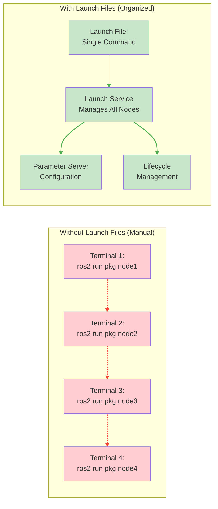
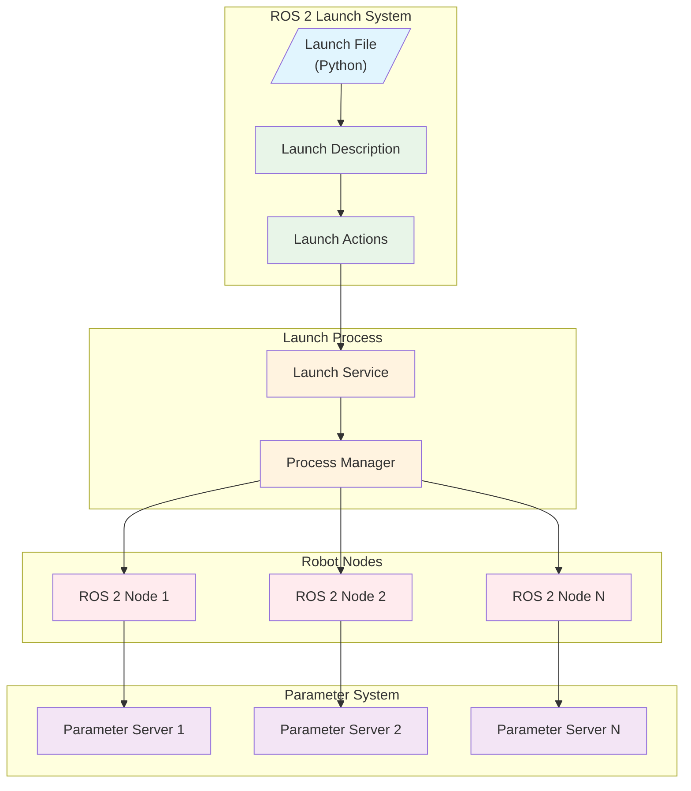
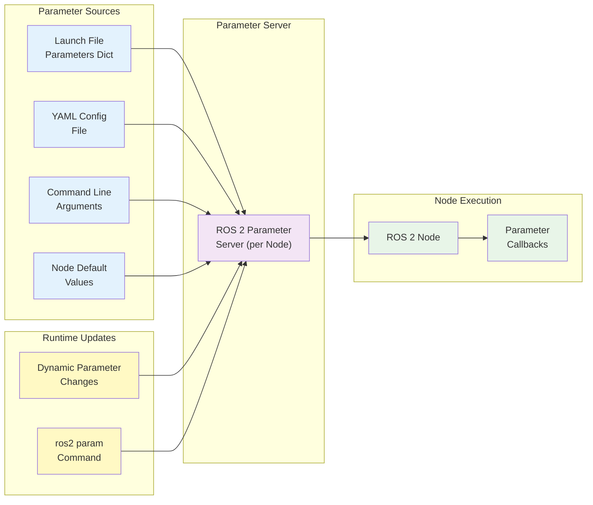

import { ChapterTranslator } from '@site/src/components/Translation';
import { ChapterPersonalizer } from '@site/src/components/Personalization';

# Chapter 5: ROS 2 Launch Files and Parameter Management

<div style={{display: 'flex', gap: '0.75rem', flexWrap: 'wrap', marginBottom: '1.5rem'}}>
  <ChapterTranslator chapterId="module-1/chapter-05-ros2-launch-files" />
  <ChapterPersonalizer chapterId="module-1/chapter-05-ros2-launch-files" />
</div>

## Section 1: Introduction to Launch Systems

### Hook: Orchestrate Your Robot's Nervous System

Imagine commanding an entire robot orchestra with a single baton. In robotics, launch files serve as that conductor's baton, orchestrating multiple nodes to work in harmony. Just as the nervous system coordinates different parts of the body, ROS 2 launch files coordinate multiple nodes to create a cohesive robot behavior.

### The Challenge of Managing Multiple ROS 2 Nodes

When building complex robot systems, you often need to run multiple nodes simultaneously. Consider a simple mobile robot that requires:

- A sensor node to process LIDAR data
- A navigation node to plan paths
- A controller node to execute movements
- A visualization node to monitor the system

Starting each node manually in separate terminals is not only cumbersome but also error-prone. What happens if you forget to start a critical node? What if you need to restart the entire system? This is where launch files come to the rescue.



### Launch Files as the Solution for Organized Robot Systems

ROS 2 launch files provide a declarative way to start multiple nodes with specific configurations. Instead of manually launching each node, you can define a launch file that starts all required nodes with their appropriate parameters, namespaces, and remappings in a single command.

This approach offers several advantages:
- **Reproducibility**: Ensures consistent system startup across different environments
- **Convenience**: Single command to start complex robot systems
- **Configuration**: Easy parameter management for different scenarios
- **Maintainability**: Clear documentation of system architecture

### Chapter Roadmap and Learning Objectives

In this chapter, you will learn to:
1. Create Python launch files to orchestrate multiple ROS 2 nodes
2. Declare and manage parameters in ROS 2 nodes
3. Organize robot systems using launch arguments and configurations
4. Use YAML parameter files for complex configurations
5. Design modular and reusable launch file structures

---

## Section 2: ROS 2 Launch Fundamentals

### Understanding the Launch System Architecture

The ROS 2 launch system is built on a flexible architecture that allows you to compose complex robot applications from simpler components. At its core, the launch system provides:

- **Launch Description**: A Python function that returns a collection of entities to be launched
- **Launch Actions**: Objects that perform specific tasks during the launch process
- **Launch Conditions**: Mechanisms to control when actions execute
- **Launch Substitutions**: Ways to dynamically compute values during launch

The launch system operates as a separate process that manages the lifecycle of all launched nodes, handling their startup, monitoring, and shutdown.



### Python vs XML Launch Files (Focus on Python)

ROS 2 supports two primary formats for launch files:

1. **Python Launch Files** (.py): More flexible and powerful, allowing complex logic
2. **XML Launch Files** (.launch.xml): Declarative, easier to read but less flexible

While both formats achieve the same goal, Python launch files offer several advantages:
- Dynamic configuration based on arguments or environment
- Complex conditional logic
- Integration with Python libraries
- Better debugging capabilities

In this chapter, we'll focus on Python launch files as they provide the most flexibility for complex robot systems.

### Basic Launch File Structure and Components

A basic Python launch file follows this structure:

```python
from launch import LaunchDescription
from launch_ros.actions import Node

def generate_launch_description():
    """Launch file entry point."""
    return LaunchDescription([
        # Launch actions go here
        Node(
            package='package_name',
            executable='executable_name',
            name='node_name',
            parameters=[
                # Parameter configurations
            ]
        )
    ])
```

The key components are:
- **Import statements**: Import necessary launch and ROS 2 actions
- **generate_launch_description()**: Entry point function that returns a LaunchDescription
- **LaunchDescription**: Container for all launch actions
- **Node actions**: Define which ROS 2 nodes to launch

### Launch Actions: ExecuteProcess, RegisterEventHandler

Launch actions are the building blocks of launch files. The most common action is `Node`, but there are others:

- **Node**: Launches a ROS 2 node
- **ExecuteProcess**: Runs arbitrary processes (not necessarily ROS 2 nodes)
- **RegisterEventHandler**: Registers event handlers to respond to specific events
- **LogInfo**: Logs information during the launch process

Example of ExecuteProcess action:

```python
from launch import LaunchDescription
from launch.actions import ExecuteProcess

def generate_launch_description():
    return LaunchDescription([
        ExecuteProcess(
            cmd=['echo', 'Starting robot system...'],
            output='screen'
        )
    ])
```

### Launch Substitutions and Conditional Execution

Launch substitutions allow you to dynamically compute values during launch. Common substitutions include:

- **LaunchConfiguration**: Get values from launch file arguments
- **PathJoinSubstitution**: Join path components
- **TextSubstitution**: Literal text values
- **EnvironmentVariable**: Get environment variables

Conditional execution allows you to run actions based on conditions:

```python
from launch import LaunchDescription
from launch.actions import LogInfo
from launch.conditions import IfCondition
from launch.substitutions import LaunchConfiguration

def generate_launch_description():
    debug_mode = LaunchConfiguration('debug', default='false')

    return LaunchDescription([
        LogInfo(
            msg='Debug mode enabled',
            condition=IfCondition(debug_mode)
        )
    ])
```

### Complete Basic Launch Example

Let's create a complete basic launch example that starts two simple nodes:

```python
from launch import LaunchDescription
from launch.actions import DeclareLaunchArgument
from launch.substitutions import LaunchConfiguration
from launch_ros.actions import Node

def generate_launch_description():
    return LaunchDescription([
        # Declare launch arguments
        DeclareLaunchArgument(
            'use_sim_time',
            default_value='false',
            description='Use simulation clock if true'
        ),

        # First node: publisher
        Node(
            package='demo_nodes_cpp',
            executable='talker',
            name='talker_node',
            parameters=[
                {'use_sim_time': LaunchConfiguration('use_sim_time')}
            ],
            output='screen'
        ),

        # Second node: subscriber
        Node(
            package='demo_nodes_cpp',
            executable='listener',
            name='listener_node',
            parameters=[
                {'use_sim_time': LaunchConfiguration('use_sim_time')}
            ],
            output='screen'
        )
    ])
```

---

## Section 3: Launching Multiple Nodes

### Creating Node Actions in Launch Files

When launching multiple nodes, each node requires its own `Node` action. The Node action accepts several parameters to configure the node's behavior:

- **package**: The ROS 2 package containing the node executable
- **executable**: The name of the executable to run
- **name**: The name to give the node (optional, defaults to executable name)
- **namespace**: The namespace to place the node in
- **parameters**: A list of parameter files or dictionaries
- **remappings**: A list of topic/service remappings
- **arguments**: Additional command-line arguments

### Setting Node Names, Namespaces, and Remappings

Node names, namespaces, and remappings provide powerful ways to organize and configure your robot system:

```python
from launch import LaunchDescription
from launch_ros.actions import Node

def generate_launch_description():
    return LaunchDescription([
        # Node with custom name and namespace
        Node(
            package='demo_nodes_cpp',
            executable='talker',
            name='custom_talker',
            namespace='robot1',
            remappings=[
                ('chatter', 'messages')
            ]
        ),

        # Another instance with different namespace
        Node(
            package='demo_nodes_cpp',
            executable='talker',
            name='custom_talker',
            namespace='robot2',
            remappings=[
                ('chatter', 'messages')
            ]
        )
    ])
```

In this example, we have two talker nodes with the same name but in different namespaces, allowing them to coexist without conflict.

### Managing Node Execution Order and Dependencies

While ROS 2 nodes are generally designed to be independent, sometimes you need to ensure certain nodes start before others. The launch system handles most dependencies automatically through topic/service connections, but you can also use event handlers:

```python
from launch import LaunchDescription
from launch.actions import RegisterEventHandler
from launch.event_handlers import OnProcessStart
from launch_ros.actions import Node

def generate_launch_description():
    talker_node = Node(
        package='demo_nodes_cpp',
        executable='talker',
        name='talker_node'
    )

    listener_node = Node(
        package='demo_nodes_cpp',
        executable='listener',
        name='listener_node'
    )

    # Start listener only after talker has started
    delayed_listener = RegisterEventHandler(
        OnProcessStart(
            target_action=talker_node,
            on_start=[listener_node]
        )
    )

    return LaunchDescription([
        talker_node,
        delayed_listener
    ])
```

### Launching Nodes with Different Configurations

You can launch multiple instances of the same node with different configurations using launch arguments:

```python
from launch import LaunchDescription
from launch.actions import DeclareLaunchArgument
from launch.substitutions import LaunchConfiguration
from launch_ros.actions import Node

def generate_launch_description():
    return LaunchDescription([
        DeclareLaunchArgument('robot_name', default_value='robot1'),
        DeclareLaunchArgument('sensor_range', default_value='10.0'),

        Node(
            package='sensor_package',
            executable='lidar_driver',
            name=[LaunchConfiguration('robot_name'), '_lidar'],
            parameters=[
                {'range': LaunchConfiguration('sensor_range')}
            ]
        )
    ])
```

### Error Handling in Launch Files

The launch system provides several mechanisms for error handling:

- **OnProcessExit**: Handle when a process exits
- **OnProcessIO**: Handle process input/output
- **OnShutdown**: Handle shutdown events

```python
from launch import LaunchDescription
from launch.actions import LogInfo, RegisterEventHandler
from launch.event_handlers import OnProcessExit
from launch_ros.actions import Node

def generate_launch_description():
    faulty_node = Node(
        package='demo_nodes_cpp',
        executable='talker',
        name='faulty_talker'
    )

    error_handler = RegisterEventHandler(
        OnProcessExit(
            target_action=faulty_node,
            on_exit=[LogInfo(msg='Node exited unexpectedly')]
        )
    )

    return LaunchDescription([
        faulty_node,
        error_handler
    ])
```

### Complete Multi-Node Launch Example

Here's a complete example of a multi-node launch file for a simple robot system:

```python
from launch import LaunchDescription
from launch.actions import DeclareLaunchArgument, TimerAction
from launch.conditions import IfCondition
from launch.substitutions import LaunchConfiguration
from launch_ros.actions import Node

def generate_launch_description():
    # Declare launch arguments
    use_sim_time = DeclareLaunchArgument(
        'use_sim_time',
        default_value='false',
        description='Use simulation clock if true'
    )

    enable_visualization = DeclareLaunchArgument(
        'enable_visualization',
        default_value='true',
        description='Launch RViz if true'
    )

    # Robot controller node
    controller_node = Node(
        package='robot_controller',
        executable='controller_node',
        name='robot_controller',
        parameters=[
            {'use_sim_time': LaunchConfiguration('use_sim_time')}
        ],
        output='screen'
    )

    # Sensor processing node
    sensor_node = Node(
        package='sensor_processing',
        executable='lidar_processor',
        name='lidar_processor',
        parameters=[
            {'use_sim_time': LaunchConfiguration('use_sim_time')}
        ],
        output='screen'
    )

    # Visualization node (conditionally launched)
    rviz_node = Node(
        package='rviz2',
        executable='rviz2',
        name='rviz',
        arguments=['-d', 'path/to/config.rviz'],
        condition=IfCondition(LaunchConfiguration('enable_visualization')),
        output='screen'
    )

    # Launch delayed RViz to allow other nodes to initialize
    delayed_rviz = TimerAction(
        period=2.0,
        actions=[rviz_node]
    )

    return LaunchDescription([
        use_sim_time,
        enable_visualization,
        controller_node,
        sensor_node,
        delayed_rviz
    ])
```

### Advanced Multi-Node Configuration Example

For more complex systems, you might want to include other launch files:

```python
from launch import LaunchDescription, LaunchSubstitution
from launch.actions import IncludeLaunchDescription
from launch.launch_description_sources import PythonLaunchDescriptionSource
from launch.substitutions import PathJoinSubstitution
from launch_ros.actions import Node

def generate_launch_description():
    return LaunchDescription([
        # Include another launch file
        IncludeLaunchDescription(
            PythonLaunchDescriptionSource(
                PathJoinSubstitution([
                    'path', 'to', 'other', 'launch', 'file.launch.py'
                ])
            )
        ),

        # Additional nodes
        Node(
            package='custom_package',
            executable='custom_node',
            name='additional_node'
        )
    ])
```

---

## Section 4: Parameter Management Basics

### Understanding ROS 2 Parameters and Parameter Servers

Parameters in ROS 2 provide a way to configure nodes at runtime. Each ROS 2 node has its own parameter server that stores key-value pairs. Parameters can be:

- Declared within the node itself
- Passed from launch files
- Set via command-line arguments
- Loaded from YAML configuration files

Parameters are ideal for configuration values that don't change frequently, such as sensor calibration values, control gains, or operational modes.



### Declaring Parameters in Nodes

Parameters must be declared before they can be used. Here's how to declare parameters in a Python node:

```python
import rclpy
from rclpy.node import Node

class ParameterNode(Node):
    def __init__(self):
        super().__init__('parameter_node')

        # Declare parameters with default values
        self.declare_parameter('sensor_range', 10.0)
        self.declare_parameter('robot_name', 'default_robot')
        self.declare_parameter('enable_logging', True)
        self.declare_parameter('wheel_diameters', [0.1, 0.1, 0.1, 0.1])  # array

        # Get parameter values
        self.sensor_range = self.get_parameter('sensor_range').value
        self.robot_name = self.get_parameter('robot_name').value
        self.enable_logging = self.get_parameter('enable_logging').value
        self.wheel_diameters = self.get_parameter('wheel_diameters').value

def main(args=None):
    rclpy.init(args=args)
    node = ParameterNode()
    rclpy.spin(node)
    node.destroy_node()
    rclpy.shutdown()

if __name__ == '__main__':
    main()
```

### Setting Parameters at Runtime

Parameters can be set at runtime in several ways:

1. **From launch files** (as shown in previous examples)
2. **From YAML parameter files**
3. **Via command line**: `ros2 run package_name executable_name --ros-args --param param_name:=value`
4. **Programmatically** within the node

### Parameter Types: Integers, Floats, Strings, Booleans, Lists

ROS 2 supports several parameter types:

- **Integer**: `42`, `-10`
- **Float**: `3.14`, `-2.5`
- **String**: `'hello'`, `"world"`
- **Boolean**: `true`, `false`
- **Lists/Arrays**: `[1, 2, 3]`, `[1.0, 2.0, 3.0]`, `['a', 'b', 'c']`
- **Dictionaries**: Nested parameter structures

### Accessing Parameters in Python Nodes

Access parameters using the `get_parameter()` method:

```python
# Get a single parameter
param_value = self.get_parameter('param_name').value

# Get multiple parameters
param1 = self.get_parameter('param1').value
param2 = self.get_parameter('param2').value
param3 = self.get_parameter('param3').value

# Check if parameter exists
if self.has_parameter('optional_param'):
    value = self.get_parameter('optional_param').value
```

### Complete Parameter Usage Example

Here's a complete example showing parameter usage in both a node and launch file:

**Parameter Node (`param_demo_node.py`):**
```python
import rclpy
from rclpy.node import Node

class ParamDemoNode(Node):
    def __init__(self):
        super().__init__('param_demo_node')

        # Declare parameters
        self.declare_parameter('robot_id', 1)
        self.declare_parameter('max_velocity', 1.0)
        self.declare_parameter('robot_name', 'default_robot')
        self.declare_parameter('sensors_enabled', [True, True, False])

        # Log parameter values
        robot_id = self.get_parameter('robot_id').value
        max_vel = self.get_parameter('max_velocity').value
        robot_name = self.get_parameter('robot_name').value
        sensors = self.get_parameter('sensors_enabled').value

        self.get_logger().info(f'Robot ID: {robot_id}')
        self.get_logger().info(f'Max Velocity: {max_vel}')
        self.get_logger().info(f'Robot Name: {robot_name}')
        self.get_logger().info(f'Sensors: {sensors}')

def main(args=None):
    rclpy.init(args=args)
    node = ParamDemoNode()
    rclpy.spin(node)
    node.destroy_node()
    rclpy.shutdown()

if __name__ == '__main__':
    main()
```

**Launch File (`param_demo_launch.py`):**
```python
from launch import LaunchDescription
from launch_ros.actions import Node

def generate_launch_description():
    return LaunchDescription([
        Node(
            package='param_demo_pkg',
            executable='param_demo_node',
            name='param_demo',
            parameters=[
                {
                    'robot_id': 5,
                    'max_velocity': 2.5,
                    'robot_name': 'advanced_robot',
                    'sensors_enabled': [True, True, True, False]
                }
            ],
            output='screen'
        )
    ])
```

### Comprehensive Parameter Example with All Types

Here's an example demonstrating all parameter types:

```python
from launch import LaunchDescription
from launch_ros.actions import Node

def generate_launch_description():
    return LaunchDescription([
        Node(
            package='demo_nodes_cpp',
            executable='parameter_node',
            name='comprehensive_param_node',
            parameters=[
                {
                    # Integer
                    'integer_param': 42,
                    # Float
                    'float_param': 3.14159,
                    # String
                    'string_param': 'hello_world',
                    # Boolean
                    'bool_param': True,
                    # Integer array
                    'int_array_param': [1, 2, 3, 4, 5],
                    # Float array
                    'float_array_param': [1.1, 2.2, 3.3],
                    # String array
                    'string_array_param': ['a', 'b', 'c'],
                    # Boolean array
                    'bool_array_param': [True, False, True],
                    # Nested parameters
                    'robot': {
                        'name': 'testbot',
                        'version': 2,
                        'active': True
                    }
                }
            ],
            output='screen'
        )
    ])
```

---

## Section 5: Advanced Launch Features

### Launch File Arguments and Command Line Parameters

Launch file arguments allow you to customize launch files at runtime. They're declared using `DeclareLaunchArgument`:

```python
from launch import LaunchDescription
from launch.actions import DeclareLaunchArgument
from launch.substitutions import LaunchConfiguration
from launch_ros.actions import Node

def generate_launch_description():
    # Declare launch arguments
    DeclareLaunchArgument(
        'robot_name',
        default_value='default_robot',
        description='Name of the robot'
    )

    DeclareLaunchArgument(
        'config_file',
        default_value='/path/to/default/config.yaml',
        description='Path to configuration file'
    )

    return LaunchDescription([
        Node(
            package='robot_package',
            executable='robot_node',
            name=[LaunchConfiguration('robot_name'), '_node'],
            parameters=[LaunchConfiguration('config_file')]
        )
    ])
```

To use arguments when launching:
```bash
ros2 launch package_name launch_file.py robot_name:=my_robot config_file:=/path/to/config.yaml
```

### Including Other Launch Files (Composition)

You can include other launch files to create modular launch systems:

```python
from launch import LaunchDescription
from launch.actions import IncludeLaunchDescription
from launch.launch_description_sources import PythonLaunchDescriptionSource
from launch.substitutions import PathJoinSubstitution
from launch_ros.actions import Node

def generate_launch_description():
    return LaunchDescription([
        # Include base robot launch file
        IncludeLaunchDescription(
            PythonLaunchDescriptionSource(
                PathJoinSubstitution([
                    'path', 'to', 'robot_base', 'robot_base.launch.py'
                ])
            )
        ),

        # Include navigation launch file
        IncludeLaunchDescription(
            PythonLaunchDescriptionSource(
                PathJoinSubstitution([
                    'path', 'to', 'navigation', 'nav.launch.py'
                ])
            )
        ),

        # Additional custom nodes
        Node(
            package='custom_package',
            executable='custom_node',
            name='custom_node'
        )
    ])
```

### Conditional Launch Based on Arguments

Use conditions to launch nodes based on arguments:

```python
from launch import LaunchDescription
from launch.actions import DeclareLaunchArgument
from launch.conditions import IfCondition, UnlessCondition
from launch.substitutions import LaunchConfiguration
from launch_ros.actions import Node

def generate_launch_description():
    return LaunchDescription([
        DeclareLaunchArgument(
            'use_sim_time',
            default_value='false',
            description='Use simulation time'
        ),

        DeclareLaunchArgument(
            'enable_debug',
            default_value='false',
            description='Enable debug nodes'
        ),

        # Launch debug node only if enabled
        Node(
            package='debug_pkg',
            executable='debug_node',
            name='debug_node',
            condition=IfCondition(LaunchConfiguration('enable_debug'))
        ),

        # Launch real hardware node unless using sim time
        Node(
            package='hardware_pkg',
            executable='hardware_node',
            name='hardware_node',
            condition=UnlessCondition(LaunchConfiguration('use_sim_time'))
        )
    ])
```

### Launch Configurations for Different Environments

Create different launch configurations for various environments:

```python
from launch import LaunchDescription
from launch.actions import DeclareLaunchArgument
from launch.substitutions import LaunchConfiguration
from launch_ros.actions import Node

def generate_launch_description():
    return LaunchDescription([
        DeclareLaunchArgument(
            'environment',
            default_value='sim',
            choices=['sim', 'dev', 'prod'],
            description='Environment to launch in'
        ),

        Node(
            package='robot_pkg',
            executable='controller',
            name='controller',
            parameters=[
                # Different config based on environment
                LaunchConfiguration('environment')
            ]
        )
    ])
```

### YAML Parameter Files Integration

YAML parameter files provide a convenient way to manage complex configurations:

**config/robot_params.yaml:**
```yaml
robot_controller:
  ros__parameters:
    max_velocity: 1.0
    acceleration_limit: 2.0
    control_frequency: 50
    sensors:
      lidar_enabled: true
      camera_enabled: false
      imu_enabled: true
```

**Launch file using YAML:**
```python
from launch import LaunchDescription
from launch.actions import DeclareLaunchArgument
from launch.substitutions import LaunchConfiguration
from launch.substitutions import PathJoinSubstitution
from launch_ros.actions import Node

def generate_launch_description():
    return LaunchDescription([
        DeclareLaunchArgument(
            'params_file',
            default_value=PathJoinSubstitution([
                'path', 'to', 'config', 'robot_params.yaml'
            ]),
            description='Path to parameters file'
        ),

        Node(
            package='robot_pkg',
            executable='controller',
            name='robot_controller',
            parameters=[LaunchConfiguration('params_file')],
            output='screen'
        )
    ])
```

### Advanced Launch File Patterns

Here are some advanced patterns for complex systems:

**Pattern 1: Grouping related nodes:**
```python
from launch import LaunchDescription
from launch.actions import GroupAction
from launch_ros.actions import Node, PushRosNamespace

def generate_launch_description():
    return LaunchDescription([
        # Group nodes under a namespace
        GroupAction(
            actions=[
                PushRosNamespace('robot1'),
                Node(
                    package='navigation',
                    executable='planner',
                    name='planner'
                ),
                Node(
                    package='navigation',
                    executable='controller',
                    name='controller'
                )
            ]
        )
    ])
```

**Pattern 2: Multiple robot systems:**
```python
from launch import LaunchDescription
from launch.actions import DeclareLaunchArgument
from launch.substitutions import LaunchConfiguration
from launch_ros.actions import Node

def create_robot_group(robot_name, namespace):
    """Helper function to create a robot group."""
    return [
        Node(
            package='robot_pkg',
            executable='driver',
            name=[robot_name, '_driver'],
            namespace=namespace,
            parameters=[{'robot_name': robot_name}]
        ),
        Node(
            package='robot_pkg',
            executable='controller',
            name=[robot_name, '_controller'],
            namespace=namespace
        )
    ]

def generate_launch_description():
    return LaunchDescription([
        DeclareLaunchArgument('robot1_name', default_value='robot_alpha'),
        DeclareLaunchArgument('robot2_name', default_value='robot_beta'),

        # Robot 1
        *create_robot_group(
            LaunchConfiguration('robot1_name'),
            LaunchConfiguration('robot1_name')
        ),

        # Robot 2
        *create_robot_group(
            LaunchConfiguration('robot2_name'),
            LaunchConfiguration('robot2_name')
        )
    ])
```

---

## Section 6: Real-World Launch Examples

### Launch File for a Complete Robot System

Let's create a complete launch file for a differential drive robot with sensors:

```python
from launch import LaunchDescription
from launch.actions import DeclareLaunchArgument, TimerAction
from launch.conditions import IfCondition
from launch.substitutions import LaunchConfiguration, PathJoinSubstitution
from launch_ros.actions import Node
from launch_ros.substitutions import FindPackageShare

def generate_launch_description():
    # Declare launch arguments
    use_sim_time = DeclareLaunchArgument(
        'use_sim_time',
        default_value='false',
        description='Use simulation clock if true'
    )

    enable_rviz = DeclareLaunchArgument(
        'enable_rviz',
        default_value='true',
        description='Launch RViz'
    )

    robot_config = DeclareLaunchArgument(
        'robot_config',
        default_value='config/diffbot.yaml',
        description='Path to robot configuration file'
    )

    # Robot state publisher
    robot_state_publisher = Node(
        package='robot_state_publisher',
        executable='robot_state_publisher',
        name='robot_state_publisher',
        parameters=[
            {'use_sim_time': LaunchConfiguration('use_sim_time')},
            LaunchConfiguration('robot_config')
        ],
        output='screen'
    )

    # Joint state publisher (for simulation)
    joint_state_publisher = Node(
        package='joint_state_publisher',
        executable='joint_state_publisher',
        name='joint_state_publisher',
        parameters=[
            {'use_sim_time': LaunchConfiguration('use_sim_time')}
        ]
    )

    # Odom broadcaster
    odom_broadcaster = Node(
        package='diffbot_pkg',
        executable='odom_broadcaster',
        name='odom_broadcaster',
        parameters=[
            {'use_sim_time': LaunchConfiguration('use_sim_time')}
        ]
    )

    # Robot controller
    robot_controller = Node(
        package='diffbot_pkg',
        executable='robot_controller',
        name='robot_controller',
        parameters=[
            {'use_sim_time': LaunchConfiguration('use_sim_time')},
            LaunchConfiguration('robot_config')
        ]
    )

    # LIDAR driver
    lidar_driver = Node(
        package='lidar_pkg',
        executable='lidar_node',
        name='lidar_driver',
        parameters=[
            {'use_sim_time': LaunchConfiguration('use_sim_time')}
        ]
    )

    # Navigation stack
    nav_stack = Node(
        package='nav2_bringup',
        executable='nav2_launch',
        name='nav_stack',
        parameters=[
            {'use_sim_time': LaunchConfiguration('use_sim_time')}
        ]
    )

    # RViz (with delay to allow other nodes to initialize)
    rviz_config = PathJoinSubstitution([
        FindPackageShare('diffbot_pkg'),
        'rviz',
        'diffbot_config.rviz'
    ])

    rviz = Node(
        package='rviz2',
        executable='rviz2',
        name='rviz2',
        arguments=['-d', rviz_config],
        condition=IfCondition(LaunchConfiguration('enable_rviz')),
        parameters=[
            {'use_sim_time': LaunchConfiguration('use_sim_time')}
        ]
    )

    delayed_rviz = TimerAction(
        period=3.0,
        actions=[rviz]
    )

    return LaunchDescription([
        use_sim_time,
        enable_rviz,
        robot_config,
        robot_state_publisher,
        joint_state_publisher,
        odom_broadcaster,
        robot_controller,
        lidar_driver,
        nav_stack,
        delayed_rviz
    ])
```

### Different Launch Configurations (Simulation vs Real Robot)

Create separate launch configurations for simulation and real hardware:

**sim_launch.py:**
```python
from launch import LaunchDescription
from launch.actions import IncludeLaunchDescription
from launch.launch_description_sources import PythonLaunchDescriptionSource
from launch.substitutions import PathJoinSubstitution
from launch_ros.actions import Node
from launch_ros.substitutions import FindPackageShare

def generate_launch_description():
    return LaunchDescription([
        # Use simulation time
        Node(
            package='gazebo_ros',
            executable='clock_bridge',
            name='clock_bridge'
        ),

        # Include common robot launch
        IncludeLaunchDescription(
            PythonLaunchDescriptionSource(
                PathJoinSubstitution([
                    FindPackageShare('robot_pkg'),
                    'launch',
                    'common.launch.py'
                ])
            ),
            launch_arguments={
                'use_sim_time': 'true'
            }.items()
        ),

        # Gazebo simulation
        IncludeLaunchDescription(
            PythonLaunchDescriptionSource(
                PathJoinSubstitution([
                    FindPackageShare('gazebo_ros'),
                    'launch',
                    'gazebo.launch.py'
                ])
            )
        )
    ])
```

**real_launch.py:**
```python
from launch import LaunchDescription
from launch.actions import IncludeLaunchDescription
from launch.launch_description_sources import PythonLaunchDescriptionSource
from launch.substitutions import PathJoinSubstitution
from launch_ros.actions import Node
from launch_ros.substitutions import FindPackageShare

def generate_launch_description():
    return LaunchDescription([
        # Real hardware drivers
        Node(
            package='hardware_interface',
            executable='real_robot_driver',
            name='real_robot_driver'
        ),

        # Include common robot launch
        IncludeLaunchDescription(
            PythonLaunchDescriptionSource(
                PathJoinSubstitution([
                    FindPackageShare('robot_pkg'),
                    'launch',
                    'common.launch.py'
                ])
            ),
            launch_arguments={
                'use_sim_time': 'false'
            }.items()
        )
    ])
```

### Parameter Files for Robot Variants

Create different parameter files for different robot variants:

**config/diffbot_params.yaml:**
```yaml
diffbot_controller:
  ros__parameters:
    wheel_radius: 0.05
    wheel_separation: 0.4
    max_linear_velocity: 1.0
    max_angular_velocity: 2.0
```

**config/omnirobot_params.yaml:**
```yaml
omnirobot_controller:
  ros__parameters:
    wheel_radius: 0.06
    wheel_separation: 0.5
    max_linear_x_velocity: 1.5
    max_linear_y_velocity: 1.5
    max_angular_velocity: 3.0
```

### Organizing Launch Files in Packages

Organize launch files within ROS 2 packages:

```
robot_pkg/
├── launch/
│   ├── common.launch.py      # Common launch components
│   ├── sim.launch.py         # Simulation-specific launch
│   ├── real.launch.py        # Real hardware launch
│   └── multi_robot.launch.py # Multi-robot launch
├── config/
│   ├── robot_params.yaml     # Main robot parameters
│   ├── sensors.yaml          # Sensor parameters
│   └── controllers.yaml      # Controller parameters
└── rviz/
    └── default_config.rviz   # RViz configuration
```

### Best Practices for Launch File Structure

1. **Modularity**: Break large launch files into smaller, reusable components
2. **Parameter Separation**: Use YAML files for complex parameter configurations
3. **Conditional Launching**: Use conditions to enable/disable components
4. **Error Handling**: Include event handlers for robust operation
5. **Documentation**: Comment launch files to explain the purpose of each component
6. **Default Values**: Provide sensible defaults for all launch arguments

---

## Section 7: Chapter Summary and Next Steps

### Key Takeaways from Launch and Parameter Management

In this chapter, you've learned to:

1. **Create Python launch files** that orchestrate multiple ROS 2 nodes with proper configuration
2. **Manage parameters effectively** to make your robot systems flexible and configurable
3. **Organize complex systems** using launch arguments, conditions, and modular components
4. **Use YAML parameter files** for complex configuration management
5. **Design reusable launch file structures** that work across different environments

Launch files and parameter management form the backbone of professional ROS 2 robot systems, enabling reproducible, configurable, and maintainable robot applications.

### Preview of Simulation Integration in Module 2

In Module 2, you'll explore simulation environments where launch files become even more critical. You'll learn to:

- Launch simulation environments with Gazebo
- Configure robots for both simulation and real hardware using the same launch files
- Create complex multi-robot simulation scenarios
- Integrate AI agents with simulated robots using launch systems

### Additional Resources for Advanced Launch Systems

To deepen your understanding of launch systems:

- **ROS 2 Launch Documentation**: Official guide to all launch features
- **Launch System Design**: Architecture and implementation details
- **Advanced Parameter Techniques**: Complex parameter management patterns
- **Launch File Best Practices**: Industry standards for large-scale systems

---

## Exercises and Practical Applications

1. Create a launch file that starts a simple robot with LIDAR, camera, and IMU sensors
2. Implement parameter management for a mobile robot's control parameters
3. Design a launch file that can work in both simulation and real hardware environments
4. Create a multi-robot launch configuration with unique parameters for each robot

This chapter has equipped you with the essential skills to manage complex robot systems using ROS 2 launch files and parameter management. These tools are fundamental for building professional robot applications that are maintainable, configurable, and scalable.