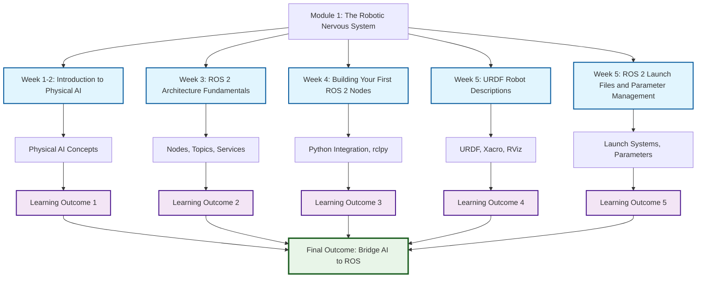
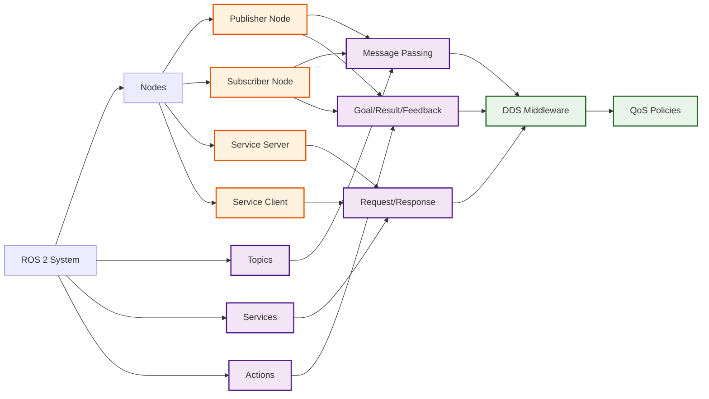
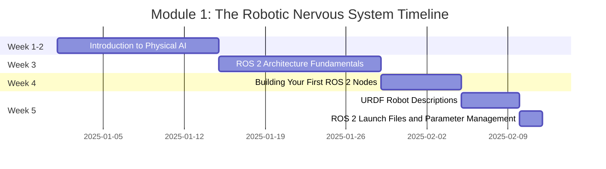

import ChapterCard from '@site/src/components/ChapterCard';
import { ChapterPersonalizer } from '@site/src/components/Personalization';


# Module 1: The Robotic Nervous System (ROS 2)

<div style={{display: 'flex', gap: '0.75rem', flexWrap: 'wrap', marginBottom: '1.5rem'}}>
  <ChapterPersonalizer chapterId="module-1/index" />
</div>

## Purpose

Welcome to Module 1 of "Physical AI & Humanoid Robotics," where we embark on a journey into the foundational technology that powers intelligent robots: **ROS 2 (Robot Operating System 2)**. Just as a nervous system integrates sensory input, processes information, and coordinates motor responses in biological organisms, ROS 2 serves as the central communication backbone for sophisticated robotic systems. This overview page provides a comprehensive guide to what you will achieve, the topics we'll explore, and the path to mastering ROS 2.

In this module, you will learn why ROS 2 is indispensable for modern robotics, enabling modular development, robust communication, and seamless integration of various hardware and software components. Over the next five weeks (Weeks 1-5), you will gain practical skills in ROS 2 fundamentals, Python integration with `rclpy`, and the creation of detailed robot descriptions using URDF. This foundational knowledge is crucial for understanding embodied intelligence and preparing you to build and control humanoid robots throughout the rest of the 13-week course.

## Learning Outcomes

Upon completing Module 1, you will be able to:

1.  **Understand Physical AI and embodied intelligence**, recognizing how digital AI concepts are integrated with physical robots to create intelligent, autonomous systems.
2.  **Master ROS 2 fundamentals**, including the roles and interactions of nodes, topics, services, and actions in building a distributed robot control architecture.
3.  **Build functional ROS 2 packages with Python (`rclpy`)**, demonstrating proficiency in creating publisher/subscriber and service client/server applications for robot communication.
4.  **Create accurate and descriptive URDF (Unified Robot Description Format) models** for humanoid robots, effectively defining their physical structure, joint limits, and sensor placements.
5.  **Bridge Python AI agents to ROS controllers**, enabling intelligent decision-making algorithms to command and control robotic hardware or simulate robotic environments.

## Prerequisites

To make the most of this module, students should have:

*   **Required:** A solid understanding of Python basics, including syntax, data structures, functions, and object-oriented programming concepts. Familiarity with command-line interfaces (terminal navigation, basic commands like `ls`, `cd`, `mkdir`) is also essential.
*   **Helpful:** A basic grasp of Artificial Intelligence or Machine Learning concepts will provide a beneficial context, though it is not a strict requirement.
*   **Software:** We will use Ubuntu 22.04 LTS as our operating system, ROS 2 Humble Hawksbill, and Python 3.10+. Detailed setup instructions will be provided.
*   **Hardware for Module 1:** No specific robotics hardware is required to begin. This module can be completed entirely through powerful simulation environments like Gazebo and Isaac Sim (cloud-based). For those interested, hardware paths range from a Jetson Edge Kit (~$700) to a full Robot Lab setup (~$3000), which will be discussed later in the course.
*   **Time Commitment:** Students should anticipate dedicating approximately 3-5 hours per week to lectures, readings, and hands-on practical exercises.

## Chapter Overview

Module 1 is structured into five comprehensive chapters, each building upon the last to provide a complete understanding of ROS 2 and its applications in Physical AI.

<div className="container">
  <div className="row">
    <ChapterCard
      number="1"
      title="Introduction to Physical AI"
      duration="Week 1-2"
      difficulty="Beginner"
      wordCount="4000"
      link="./chapter-01-intro-physical-ai"
    />
    <ChapterCard
      number="2"
      title="ROS 2 Architecture Fundamentals"
      duration="Week 3"
      difficulty="Beginner"
      wordCount="3500"
      link="./chapter-02-ros2-architecture"
    />
    <ChapterCard
      number="3"
      title="Building Your First ROS 2 Nodes"
      duration="Week 4"
      difficulty="Intermediate"
      wordCount="4000"
      link="./chapter-03-first-nodes"
    />
    <ChapterCard
      number="4"
      title="URDF Robot Descriptions"
      duration="Week 5"
      difficulty="Intermediate"
      wordCount="3500"
      link="./chapter-04-urdf"
    />
    <ChapterCard
      number="5"
      title="ROS 2 Launch Files and Parameter Management"
      duration="Week 5"
      difficulty="Intermediate"
      wordCount="3500"
      link="./module-1-chapter-05-ros2-launch-files"
    />
  </div>
</div>

## Module Roadmap

This roadmap outlines your journey through Module 1, highlighting key milestones and what to expect:

*   **Week 1-2: Physical AI Introduction** – We begin with the theoretical underpinnings of Physical AI and embodied intelligence, understanding why humanoid robots are at the forefront of this field. You'll gain a conceptual understanding of sensor systems and the challenges of integrating AI with the physical world.
*   **Week 3: ROS 2 Architecture** – Dive deep into the core components of ROS 2, dissecting nodes, topics, services, and actions. You'll understand the role of DDS middleware and Quality of Service (QoS) settings in robust robot communication.
*   **Week 4: Building Your First Nodes** – Get hands-on with Python (`rclpy`) to create your first ROS 2 publisher and subscriber nodes. You'll learn how to define custom messages and use launch files for complex system orchestration.
*   **Week 5: URDF Robot Descriptions and Launch Systems** – Conclude the module by mastering URDF (Unified Robot Description Format) for describing humanoid robot links, joints, and frames. You'll also learn to create sophisticated launch files for orchestrating multiple ROS 2 nodes with proper parameter management.

After successfully navigating Module 1, you will have a strong foundation in ROS 2, empowering you to proceed to Module 2, where we will delve into more advanced topics such as robot perception, navigation, and manipulation.

## Diagrams

### Module 1 Learning Path



### ROS 2 Architecture Overview



### Module 1 Timeline



## Interactive Components

Beyond static content, this module integrates interactive components for an enhanced learning experience:

### Chapter Cards

We utilize custom Docusaurus components for interactive chapter navigation. These cards provide a visually engaging and organized way to explore each chapter's content, detailing its duration, difficulty, and key topics at a glance.

### Progress Indicator (Optional)

A visual progress indicator will help you track your learning journey through the module and understand the estimated time commitment.

## Navigation

*   **Next:** [Chapter 1: Introduction to Physical AI →](./chapter-01-intro-physical-ai)
*   **Previous:** [Getting Started ←](/docs/) (Course overview and prerequisites)

The sidebar will also provide direct links to this overview page and all five chapters within Module 1, ensuring seamless navigation.

## Call-to-Action

**Ready to Start Your Journey?**

*   <button class="button button--primary button--lg">Start Chapter 1 →</button> (Links to: `/mnt/e/AI_Spec-Driven_Online_Hackathon_1/book-write/docs/module-1/chapter-01-intro-physical-ai`)
*   <button class="button button--secondary button--lg">Review Prerequisites</button> (Links to: `/mnt/e/AI_Spec-Driven_Online_Hackathon_1/book-write/docs/getting-started/index` if available)
*   Help: Ask RAG Chatbot (accessible at the bottom-right of the page for quick queries)

## Sidebar Configuration (TypeScript)

To integrate this module correctly into the Docusaurus navigation, the `sidebars.ts` file needs the following configuration:

```typescript
// book-write/sidebars.ts
{
  type: 'category',
  label: '📘 Module 1: The Robotic Nervous System (ROS 2)',
  collapsible: true,
  collapsed: false,
  items: [
    'module-1/index',  // THIS PAGE (Module 1 Overview)
    'module-1/chapter-01-intro-physical-ai',
    'module-1/chapter-02-ros2-architecture',
    'module-1/chapter-03-first-nodes',
    'module-1/chapter-04-urdf',
    'module-1/chapter-05-ros2-launch-files',
  ],
}
```
