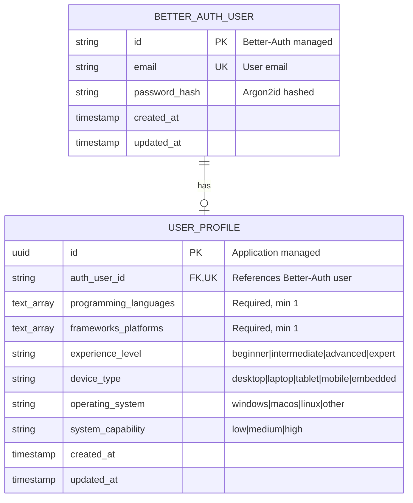

# Data Model: Authentication & User Personalization

**Feature**: auth-personalization
**Date**: 2025-12-16
**Status**: Final

---

## 1. Entity Overview



---

## 2. Data Ownership

### 2.1 Better-Auth Owned (DO NOT DEFINE)

Better-Auth manages these tables automatically. The application MUST NOT create, modify, or directly query them.

| Table | Purpose | Notes |
|-------|---------|-------|
| `better_auth_user` | User accounts | email, password_hash, timestamps |
| `better_auth_session` | Active sessions | token, user_id, expires_at |
| `better_auth_account` | OAuth providers | Unused in this implementation |
| `better_auth_verification` | Email verification | Unused in this implementation |

### 2.2 Application Owned

The application owns and manages this table:

| Table | Purpose | Notes |
|-------|---------|-------|
| `user_profiles` | User background data | Linked to Better-Auth via auth_user_id |

---

## 3. Entity: user_profiles

### 3.1 Schema Definition

```sql
CREATE TABLE user_profiles (
    -- Primary key
    id UUID PRIMARY KEY DEFAULT gen_random_uuid(),

    -- Foreign key to Better-Auth user (soft reference)
    auth_user_id VARCHAR(255) UNIQUE NOT NULL,

    -- Software background (required)
    programming_languages TEXT[] NOT NULL,
    frameworks_platforms TEXT[] NOT NULL,
    experience_level VARCHAR(20) NOT NULL,

    -- Hardware background (required)
    device_type VARCHAR(20) NOT NULL,
    operating_system VARCHAR(20) NOT NULL,
    system_capability VARCHAR(10) NOT NULL,

    -- Timestamps
    created_at TIMESTAMPTZ NOT NULL DEFAULT NOW(),
    updated_at TIMESTAMPTZ NOT NULL DEFAULT NOW(),

    -- Constraints
    CONSTRAINT experience_level_check CHECK (
        experience_level IN ('beginner', 'intermediate', 'advanced', 'expert')
    ),
    CONSTRAINT device_type_check CHECK (
        device_type IN ('desktop', 'laptop', 'tablet', 'mobile', 'embedded')
    ),
    CONSTRAINT operating_system_check CHECK (
        operating_system IN ('windows', 'macos', 'linux', 'other')
    ),
    CONSTRAINT system_capability_check CHECK (
        system_capability IN ('low', 'medium', 'high')
    ),
    CONSTRAINT programming_languages_not_empty CHECK (
        array_length(programming_languages, 1) > 0
    ),
    CONSTRAINT frameworks_platforms_not_empty CHECK (
        array_length(frameworks_platforms, 1) > 0
    )
);

-- Index for auth_user_id lookups
CREATE INDEX idx_user_profiles_auth_user_id ON user_profiles(auth_user_id);

-- Trigger for updated_at
CREATE OR REPLACE FUNCTION update_updated_at_column()
RETURNS TRIGGER AS $$
BEGIN
    NEW.updated_at = NOW();
    RETURN NEW;
END;
$$ language 'plpgsql';

CREATE TRIGGER update_user_profiles_updated_at
    BEFORE UPDATE ON user_profiles
    FOR EACH ROW
    EXECUTE FUNCTION update_updated_at_column();
```

### 3.2 Field Specifications

| Field | Type | Nullable | Default | Validation |
|-------|------|----------|---------|------------|
| `id` | UUID | No | `gen_random_uuid()` | Auto-generated |
| `auth_user_id` | VARCHAR(255) | No | - | Unique, references Better-Auth user |
| `programming_languages` | TEXT[] | No | - | Non-empty array |
| `frameworks_platforms` | TEXT[] | No | - | Non-empty array |
| `experience_level` | VARCHAR(20) | No | - | Enum check constraint |
| `device_type` | VARCHAR(20) | No | - | Enum check constraint |
| `operating_system` | VARCHAR(20) | No | - | Enum check constraint |
| `system_capability` | VARCHAR(10) | No | - | Enum check constraint |
| `created_at` | TIMESTAMPTZ | No | `NOW()` | Auto-set on insert |
| `updated_at` | TIMESTAMPTZ | No | `NOW()` | Auto-updated via trigger |

### 3.3 Enum Values

#### experience_level
| Value | Description |
|-------|-------------|
| `beginner` | 0-1 years experience |
| `intermediate` | 1-3 years experience |
| `advanced` | 3-5 years experience |
| `expert` | 5+ years experience |

#### device_type
| Value | Description |
|-------|-------------|
| `desktop` | Desktop computer |
| `laptop` | Laptop computer |
| `tablet` | Tablet device |
| `mobile` | Mobile phone |
| `embedded` | Embedded device (Raspberry Pi, Jetson, etc.) |

#### operating_system
| Value | Description |
|-------|-------------|
| `windows` | Microsoft Windows |
| `macos` | Apple macOS |
| `linux` | Linux distributions |
| `other` | Other OS |

#### system_capability
| Value | Description |
|-------|-------------|
| `low` | Basic web browsing capable |
| `medium` | Can run IDEs and light simulations |
| `high` | Can run heavy simulations and GPU workloads |

### 3.4 Predefined Options for Multi-Select Fields

#### programming_languages
- Python
- JavaScript/TypeScript
- C/C++
- Java
- Go
- Rust
- Other

#### frameworks_platforms
- ROS/ROS 2
- TensorFlow
- PyTorch
- OpenCV
- Arduino/Embedded
- Web Development
- Mobile Development
- Other

---

## 4. TypeScript Types

### 4.1 Database Types (Drizzle Schema)

```typescript
// src/db/schema.ts
import { pgTable, uuid, varchar, text, timestamp } from 'drizzle-orm/pg-core';

export const userProfiles = pgTable('user_profiles', {
  id: uuid('id').primaryKey().defaultRandom(),
  authUserId: varchar('auth_user_id', { length: 255 }).unique().notNull(),
  programmingLanguages: text('programming_languages').array().notNull(),
  frameworksPlatforms: text('frameworks_platforms').array().notNull(),
  experienceLevel: varchar('experience_level', { length: 20 }).notNull(),
  deviceType: varchar('device_type', { length: 20 }).notNull(),
  operatingSystem: varchar('operating_system', { length: 20 }).notNull(),
  systemCapability: varchar('system_capability', { length: 10 }).notNull(),
  createdAt: timestamp('created_at', { withTimezone: true }).defaultNow().notNull(),
  updatedAt: timestamp('updated_at', { withTimezone: true }).defaultNow().notNull(),
});

export type UserProfile = typeof userProfiles.$inferSelect;
export type NewUserProfile = typeof userProfiles.$inferInsert;
```

### 4.2 API Types

```typescript
// src/types/api.ts

// Enums
export type ExperienceLevel = 'beginner' | 'intermediate' | 'advanced' | 'expert';
export type DeviceType = 'desktop' | 'laptop' | 'tablet' | 'mobile' | 'embedded';
export type OperatingSystem = 'windows' | 'macos' | 'linux' | 'other';
export type SystemCapability = 'low' | 'medium' | 'high';

// Software Background
export interface SoftwareBackground {
  programming_languages: string[];
  frameworks_platforms: string[];
  experience_level: ExperienceLevel;
}

// Hardware Background
export interface HardwareBackground {
  device_type: DeviceType;
  operating_system: OperatingSystem;
  system_capability: SystemCapability;
}

// Create Profile Request
export interface CreateProfileRequest {
  software_background: SoftwareBackground;
  hardware_background: HardwareBackground;
}

// Update Profile Request
export interface UpdateProfileRequest {
  software_background?: Partial<SoftwareBackground>;
  hardware_background?: Partial<HardwareBackground>;
}

// Profile Response
export interface ProfileResponse {
  auth_user_id: string;
  email: string; // From Better-Auth context
  software_background: SoftwareBackground;
  hardware_background: HardwareBackground;
  created_at: string; // ISO 8601
  updated_at: string; // ISO 8601
}

// Error Response
export interface ErrorResponse {
  error: string;
  field?: string;
  message: string;
}
```

---

## 5. State Transitions

### 5.1 Profile Lifecycle

```
┌─────────────┐
│   (none)    │
└──────┬──────┘
       │ POST /api/profile (after signup)
       ▼
┌─────────────┐
│   created   │
└──────┬──────┘
       │ PUT /api/profile
       ▼
┌─────────────┐
│   updated   │◄──────┐
└──────┬──────┘       │
       │              │ PUT /api/profile
       └──────────────┘
```

### 5.2 State Rules

| Current State | Action | Next State | Notes |
|---------------|--------|------------|-------|
| (none) | POST /api/profile | created | Must have valid Better-Auth session |
| created | PUT /api/profile | updated | `updated_at` timestamp changes |
| updated | PUT /api/profile | updated | `updated_at` timestamp changes |
| any | Better-Auth user deleted | (none) | Profile should be cleaned up |

---

## 6. Relationships

### 6.1 User → Profile (1:1)

| Aspect | Details |
|--------|---------|
| Cardinality | One-to-one |
| Direction | Better-Auth user owns profile |
| Enforcement | UNIQUE constraint on auth_user_id |
| Cascade | Application handles (no DB-level FK) |

### 6.2 Why No Database Foreign Key?

The `auth_user_id` column does NOT have a database-level foreign key constraint because:

1. **Cross-schema ownership**: Better-Auth manages its own tables
2. **No direct table access**: Application should not directly query Better-Auth tables
3. **Soft reference**: Application validates via Better-Auth API, not DB join
4. **Cleanup responsibility**: Application deletes orphaned profiles via API/cron

---

## 7. Validation Rules

### 7.1 Database-Level Validation

| Field | Constraint | Error |
|-------|------------|-------|
| `programming_languages` | `array_length(...) > 0` | Cannot be empty |
| `frameworks_platforms` | `array_length(...) > 0` | Cannot be empty |
| `experience_level` | CHECK IN enum values | Invalid experience level |
| `device_type` | CHECK IN enum values | Invalid device type |
| `operating_system` | CHECK IN enum values | Invalid operating system |
| `system_capability` | CHECK IN enum values | Invalid system capability |
| `auth_user_id` | UNIQUE | Profile already exists for user |

### 7.2 Application-Level Validation

| Field | Validation | Error Message |
|-------|------------|---------------|
| `programming_languages` | Each item in predefined list or "Other" | Invalid programming language: {value} |
| `frameworks_platforms` | Each item in predefined list or "Other" | Invalid framework/platform: {value} |
| Request body | All required fields present | Missing required field: {field} |
| Session | Valid Better-Auth session | Unauthorized |

---

## 8. Indexes

| Index | Columns | Type | Purpose |
|-------|---------|------|---------|
| Primary | `id` | B-tree (PK) | Row identification |
| Unique | `auth_user_id` | B-tree (UNIQUE) | User lookup, uniqueness |

---

## 9. Migration Strategy

### 9.1 Initial Migration

```sql
-- Migration: 001_create_user_profiles.sql
-- Created: 2025-12-16

BEGIN;

CREATE TABLE user_profiles (
    id UUID PRIMARY KEY DEFAULT gen_random_uuid(),
    auth_user_id VARCHAR(255) UNIQUE NOT NULL,
    programming_languages TEXT[] NOT NULL,
    frameworks_platforms TEXT[] NOT NULL,
    experience_level VARCHAR(20) NOT NULL,
    device_type VARCHAR(20) NOT NULL,
    operating_system VARCHAR(20) NOT NULL,
    system_capability VARCHAR(10) NOT NULL,
    created_at TIMESTAMPTZ NOT NULL DEFAULT NOW(),
    updated_at TIMESTAMPTZ NOT NULL DEFAULT NOW(),

    CONSTRAINT experience_level_check CHECK (
        experience_level IN ('beginner', 'intermediate', 'advanced', 'expert')
    ),
    CONSTRAINT device_type_check CHECK (
        device_type IN ('desktop', 'laptop', 'tablet', 'mobile', 'embedded')
    ),
    CONSTRAINT operating_system_check CHECK (
        operating_system IN ('windows', 'macos', 'linux', 'other')
    ),
    CONSTRAINT system_capability_check CHECK (
        system_capability IN ('low', 'medium', 'high')
    ),
    CONSTRAINT programming_languages_not_empty CHECK (
        array_length(programming_languages, 1) > 0
    ),
    CONSTRAINT frameworks_platforms_not_empty CHECK (
        array_length(frameworks_platforms, 1) > 0
    )
);

CREATE INDEX idx_user_profiles_auth_user_id ON user_profiles(auth_user_id);

CREATE OR REPLACE FUNCTION update_updated_at_column()
RETURNS TRIGGER AS $$
BEGIN
    NEW.updated_at = NOW();
    RETURN NEW;
END;
$$ language 'plpgsql';

CREATE TRIGGER update_user_profiles_updated_at
    BEFORE UPDATE ON user_profiles
    FOR EACH ROW
    EXECUTE FUNCTION update_updated_at_column();

COMMIT;
```

---

**END OF DATA MODEL**
